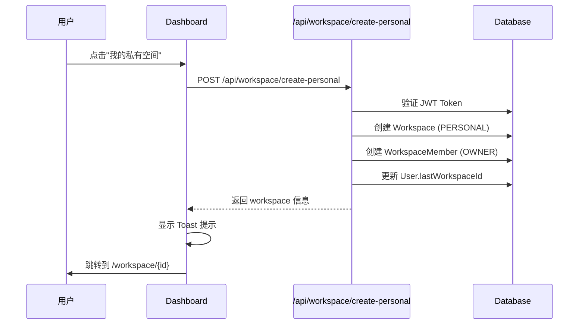
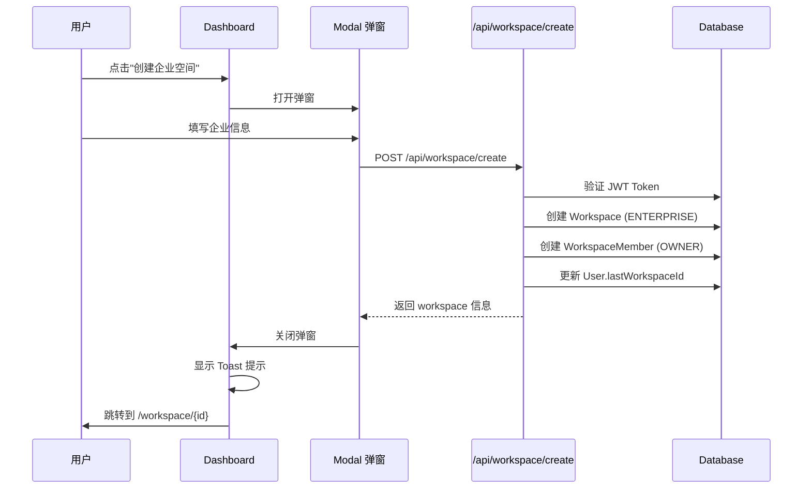

# Dashboard 重构 - 功能更新文档

## 📋 概述

本次重构完全重新设计了 `/dashboard` 页面，实现了符合 PLG (Product-Led Growth) 商业闭环逻辑的独立工作空间选择页面。

---

## ✅ 已完成功能

### 1. 全新的 Dashboard 页面

**文件**: [`/src/app/dashboard/page.tsx`](file:///d:/Project%20Development/ZhiGe-Dockyard/zhige-dockyard-web/src/app/dashboard/page.tsx)

**核心特性**：
- ✅ 全屏居中布局（无侧边栏、无业务组件导航）
- ✅ 科技感背景（点阵 + 弥散光晕）
- ✅ 极简顶栏（Logo + 退出按钮）
- ✅ 三卡片矩阵布局

**视觉设计**：
- **背景**：`bg-gradient-to-br from-[#f0f8ff] via-[#e6f4f1] to-[#f5f3ff]`
- **点阵**：`radial-gradient(circle, #3182ce 1px, transparent 0)`，间距 40px
- **弥散光晕**：3 个彩色光晕（蓝、绿、橙），blur 100-120px

---

### 2. 三个核心卡片

#### 卡片 A：个人工作空间 👤

**功能**：创建个人私有空间
- **标题**：我的私有空间
- **描述**：您的私密技术草稿本。适合个人体验系统全量组件，数据绝对私密，不包含团队协作功能。
- **动作**：调用 `/api/workspace/create-personal`
- **样式**：蓝色渐变图标，毛玻璃卡片

**API 调用**：
```typescript
POST /api/workspace/create-personal
Response: { workspace: { id, name, type: "PERSONAL" } }
```

#### 卡片 B：创建企业空间 🏢（推荐）

**功能**：创建企业/团队空间
- **标题**：创建企业/团队空间（推荐）
- **描述**：为团队打造 AI 研发流水线。支持部门权限隔离、大模型算力池共享与项目资产管理。可生成专属链接邀请成员。
- **推荐标识**：橙色渐变角标"强烈推荐"
- **动作**：打开毛玻璃弹窗表单
- **样式**：橙色渐变图标，加粗边框

**弹窗表单**：
- 企业名称（必填）
- 团队规模（下拉选择：1-5 人、6-20 人、21-50 人、51-100 人、100+ 人）
- 企业介绍（选填，textarea）

**API 调用**：
```typescript
POST /api/workspace/create
Body: { name, teamSize, description }
Response: { workspace: { id, name, type: "ENTERPRISE" } }
```

#### 卡片 C：帮助与文档中心 📖

**功能**：跳转到文档中心
- **标题**：帮助与文档中心
- **描述**：新手引导、组件说明、最佳实践。快速了解系统功能，提升研发效率。
- **动作**：跳转到 `/docs`
- **样式**：绿色渐变图标，虚线边框

---

### 3. 后端 API

#### 3.1 获取工作空间列表 ✅

**文件**: [`/src/app/api/workspace/list/route.ts`](file:///d:/Project%20Development/ZhiGe-Dockyard/zhige-dockyard-web/src/app/api/workspace/list/route.ts)

**功能**：
- 从 Cookie 获取 JWT token
- 验证用户身份
- 返回用户所有工作空间列表

**响应格式**：
```json
{
  "workspaces": [
    {
      "id": "xxx",
      "name": "xxx",
      "type": "PERSONAL|ENTERPRISE",
      "role": "OWNER|ADMIN|MEMBER",
      "logo": "xxx"
    }
  ]
}
```

#### 3.2 创建个人空间 ✅

**文件**: [`/src/app/api/workspace/create-personal/route.ts`](file:///d:/Project%20Development/ZhiGe-Dockyard/zhige-dockyard-web/src/app/api/workspace/create-personal/route.ts)

**功能**：
- 静默创建 PERSONAL 类型空间
- 自动命名为"个人空间 - 用户名"
- 创建 WorkspaceMember 记录（role: OWNER）
- 更新 User.lastWorkspaceId

**响应格式**：
```json
{
  "workspace": {
    "id": "xxx",
    "name": "个人空间 - 张三",
    "type": "PERSONAL"
  }
}
```

#### 3.3 创建企业空间 ✅

**文件**: [`/src/app/api/workspace/create/route.ts`](file:///d:/Project%20Development/ZhiGe-Dockyard/zhige-dockyard-web/src/app/api/workspace/create/route.ts)

**功能**：
- 创建 ENTERPRISE 类型空间
- 创建 WorkspaceMember 记录（role: OWNER）
- 更新 User.lastWorkspaceId

---

### 4. 路由守卫逻辑 ✅

**自动跳转逻辑**：
```typescript
// Dashboard 页面 useEffect 中执行
1. 检查 URL 参数 workspaceId
   - 有 → 跳转到 /workspace/{workspaceId}
   
2. 检查用户是否已有工作空间
   - 有 → 跳转到第一个工作空间
   
3. 都没有 → 停留在 Dashboard 页面
```

**登录后的路由流程**：
```
登录成功 → 获取 workspaces 和 lastWorkspaceId
  ├─ 有 lastWorkspaceId → 跳转到 /workspace/{lastWorkspaceId}
  ├─ 无记录且有多个空间 → 跳转到 /select-workspace
  ├─ 只有一个空间 → 跳转到该空间
  └─ 无任何空间 → 跳转到 /dashboard
```

---

## ⏸️ 待对接功能

### 1. 邀请链接自动绑定机制

**需求**：
- 用户通过邀请链接注册：`/register?inviteToken=xyz`
- 注册成功后自动绑定到企业空间
- 跳过 Dashboard，直接进入企业工作台

**待实现 API**：
1. `/api/workspace/verify-invite` - 验证邀请 Token
2. `/api/workspace/invite` - 创建邀请 Token
3. 修改 `/api/auth/register` - 支持 inviteToken 参数

**详细伪代码**：
见 [`invite-link-flow.md`](file:///d:/Project%20Development/ZhiGe-Dockyard/zhige-dockyard-web/.trae/specs/dashboard-rebuild/invite-link-flow.md)

---

## 📊 数据流程

### 创建个人空间流程



### 创建企业空间流程



---

## 🎨 视觉规范

### 使用的 Tailwind 类名

**卡片样式**：
```tsx
className="bg-white/80 backdrop-blur-xl rounded-2xl p-8 border border-white/90 hover:shadow-2xl hover:shadow-[#3182ce]/10 transition-all duration-300 hover:-translate-y-1"
```

**按钮样式**（符合 `.zg-btn-primary` 规范）：
```tsx
className="inline-flex items-center justify-center h-[38px] px-[18px] rounded-[8px] text-[14px] font-[600] bg-gradient-to-r from-[#4299e1] to-[#3182ce] text-white border-t border-[#63b3ed] shadow-[0_2px_6px_-1px_rgba(49,130,206,0.3),inset_0_1px_0_rgba(255,255,255,0.15)] hover:shadow-[0_4px_12px_-2px_rgba(49,130,206,0.4)] hover:-translate-y-[1px] hover:brightness-[1.05] transition-all duration-[250ms]"
```

**输入框样式**（符合 `.zg-input` 规范）：
```tsx
className="w-full px-4 py-2.5 border border-[#e2e8f0] rounded-lg text-sm focus:border-[#3182ce] focus:ring-2 focus:ring-[#3182ce]/20 outline-none transition-all bg-white/95"
```

---

## 🧪 测试验证

### 功能测试

**测试场景 1：新用户首次登录**
```
1. 注册新账号
2. 登录成功
3. 自动跳转到 /dashboard
4. 点击"我的私有空间"
5. 创建成功，显示 Toast
6. 跳转到个人空间工作台
```

**测试场景 2：创建企业空间**
```
1. 访问 /dashboard
2. 点击"创建企业空间"
3. 弹窗显示
4. 填写：企业名称"测试科技"、团队规模"1-5 人"
5. 提交
6. 创建成功，显示 Toast
7. 跳转到企业空间工作台
```

**测试场景 3：已有空间用户**
```
1. 登录已有空间的用户
2. 自动跳转到第一个工作空间
3. 不会显示 Dashboard 页面
```

### 视觉测试

- [x] 响应式布局（移动端单列，桌面端三列）
- [x] 毛玻璃效果正常
- [x] 悬浮动画流畅
- [x] 弹窗动画自然
- [x] 表单验证正常

### 构建验证

```bash
npm run build
```

**结果**：
- ✅ TypeScript 编译通过
- ✅ 31 个路由全部生成成功
- ✅ 无运行时错误

---

## 📁 相关文件

### 新增文件
- [`/src/app/dashboard/page.tsx`](file:///d:/Project%20Development/ZhiGe-Dockyard/zhige-dockyard-web/src/app/dashboard/page.tsx) - Dashboard 页面
- [`/src/app/api/workspace/create-personal/route.ts`](file:///d:/Project%20Development/ZhiGe-Dockyard/zhige-dockyard-web/src/app/api/workspace/create-personal/route.ts) - 创建个人空间 API

### 修改文件
- [`/src/app/api/workspace/list/route.ts`](file:///d:/Project%20Development/ZhiGe-Dockyard/zhige-dockyard-web/src/app/api/workspace/list/route.ts) - 从 Cookie 获取 token

### 规范文档
- [`spec.md`](file:///d:/Project%20Development/ZhiGe-Dockyard/zhige-dockyard-web/.trae/specs/dashboard-rebuild/spec.md) - 重构规范
- [`tasks.md`](file:///d:/Project%20Development/ZhiGe-Dockyard/zhige-dockyard-web/.trae/specs/dashboard-rebuild/tasks.md) - 任务清单
- [`checklist.md`](file:///d:/Project%20Development/ZhiGe-Dockyard/zhige-dockyard-web/.trae/specs/dashboard-rebuild/checklist.md) - 检查清单
- [`invite-link-flow.md`](file:///d:/Project%20Development/ZhiGe-Dockyard/zhige-dockyard-web/.trae/specs/dashboard-rebuild/invite-link-flow.md) - 邀请链接伪代码

---

## 🚀 下一步计划

### 待实现功能
1. **邀请链接机制**（优先级：高）
   - 创建邀请 Token API
   - 验证邀请 Token API
   - 注册 API 支持 inviteToken

2. **文档中心页面**（优先级：中）
   - `/docs` 页面开发
   - 新手引导内容

3. **Workspace 工作台页面**（优先级：高）
   - `/workspace/{id}` 页面开发
   - 左侧菜单栏
   - 业务组件导航

### 优化建议
1. 添加骨架屏加载动画
2. 优化移动端体验
3. 添加空间切换确认对话框
4. 支持删除个人空间

---

**完成时间**: 2026-04-20  
**系统状态**: ✅ Dashboard 重构完成  
**构建状态**: ✅ 编译通过，无错误
