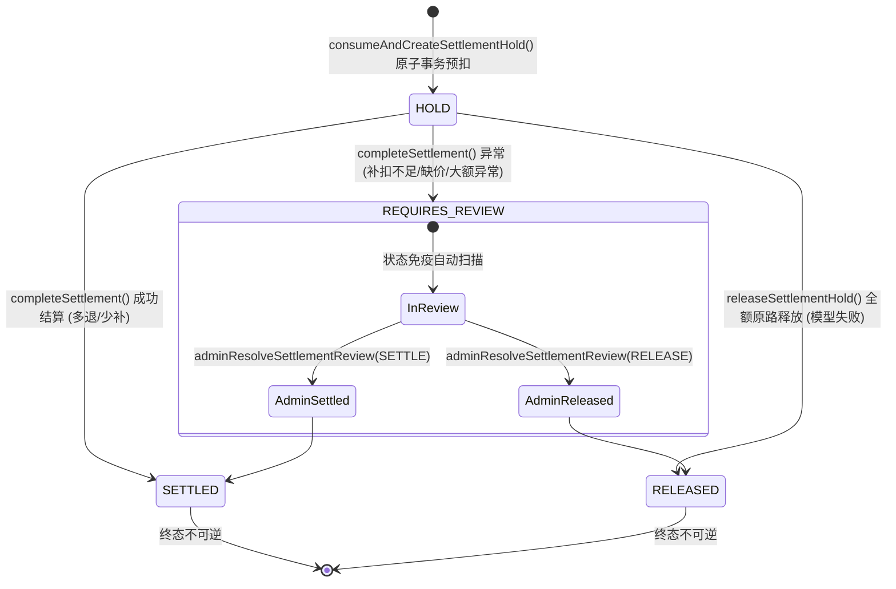

# 🚢 知阁·舟坊 (ZhiGe Dockyard) - Phase 2A 真实 Token 结算全栈架构与账务闭环设计规范

## 1. 概述与设计宗旨
在《知阁·舟坊》算力资产计费体系中，模型执行已从传统的估算模式逐步演进为依据真实底层物理消耗计费的精准账务系统。本设计规范针对 **Phase 2A 真实 Token 结算账务闭环加固**，旨在建立银行级账务防御机制，消除分布式结算与异步模型调用过程中的资金漏洞、假成功响应及并发覆盖风险。

---

## 2. 概念模型与物理量纲映射

| 概念实体 | 物理/业务含义 | 单位/存储格式 | 说明 |
| :--- | :--- | :--- | :--- |
| **Token** | 模型调用的输入/输出/缓存底层消耗物理量 | 纯整数（`BigInt`） | 由模型服务端返回的实际物理用量，杜绝负数与超大数值溢出 |
| **算力点 (Point)** | 平台账户中用户/空间所拥有的计费货币 | 纯整数（`BigInt`） | `1 算力点 = 10,000 微元 = 0.01 元`，所有点数扣减与返还必须为整数 |
| **微元 (Micros)** | 计费单价与中间结算微货币单位 | 纯整数（`BigInt`） | `1 元 = 1,000,000 微元`；模型单价以 `微元 / 百万 Token` 表示 |
| **折算比率** | 用量到点数的精确换算比率 | 纯整数运算 | `点数 = (用量 * 单价微元 / 1,000,000 + 9,999) / 10,000`（无条件向上取整，保障资金安全） |

---

## 3. 数据库表结构与状态机约束

### 3.1 核心表关系与状态机映射



### 3.2 表结构定义及约束清单

1. **`tokensettlementhold` (预扣冻结单)**：
   - `id`: 主键 UUID
   - `taskId`: 任务唯一标识（业务外键，`UNIQUE INDEX`）
   - `userId`, `workspaceId`: 归属用户及工作空间
   - `holdPoints`: 预扣算力点数（若为无限额度账户则强制设为 `0`）
   - `monthlyTokenUsedIncremented`: 预扣阶段在成员记录中累加的月度用量差额（用于后续精准逆向回滚）
   - `holdDetails`: 结构化 JSON，包含预扣分桶明细、逐条流水记录 `consumeLedgerIds`、消费幂等键 `consumeIdempotencyKey`、无限额度标识 `isUnlimited`
   - `status`: `HELD` -> `SETTLED` / `RELEASED` / `REQUIRES_REVIEW`
   - `expiresAt`: 冻结过期时间戳
   - `updatedAt`: 状态变更时间

2. **`tokensettlement` (结算主账单)**：
   - `id`: 主键 UUID
   - `taskId`: 任务唯一标识（`UNIQUE INDEX`）
   - `status`: `HOLD` -> `SETTLED` / `RELEASED` / `REQUIRES_REVIEW`（必须与 `tokensettlementhold` 严格同事务保持一致）
   - `pricingSnapshot`: 冻结时的模型单价与加价规则快照 JSON，结算时以此快照为唯一真实真源，严禁读取即时动态单价
   - `actualInputTokens`, `actualOutputTokens`, `totalCostMicros`, `totalPriceMicros`: 真实物理消耗与微元记录
   - `settlementVersion`: 乐观锁版本计数器，每次流转递增

3. **`tokensettlementrecovery` (分布式恢复任务队列)**：
   - `id`: 主键 UUID
   - `taskId`: 关联任务（`UNIQUE INDEX`）
   - `recoveryType`: `SETTLEMENT_FAILED` / `RELEASE_FAILED` / `HOLD_EXPIRED`
   - `status`: `PENDING` -> `PROCESSING` -> `COMPLETED` / `REQUIRES_REVIEW`
   - `claimToken`: 认领 Worker 的专属 UUID
   - `leaseUntil`: 认领租约到期时间戳（默认 60 秒）
   - `retryCount`: 累计重试次数，达上限（默认 5 次）自动转为 `REQUIRES_REVIEW`
   - `payload`: 包含恢复所需的完整的 `usage`、`pricingSnapshot`、`workspaceType`、`points` 快照

---

## 4. 核心业务流程与防御性设计

### 4.1 原子事务预扣 (`consumeAndCreateSettlementHold`)
- **零资金残留保证**：
  在单个 Prisma 事务内，按排他锁顺序依次锁定：
  1. `userwallet`（用户个人钱包）
  2. `workspacequota`（工作空间公共配额）
  3. `workspacemember`（企业工作空间成员个人额度）
- 锁定后调用共享扣点核心，并立即逐条检验 `pointledger` 流水的存在性、方向（`OUT`）、类型（`CONSUME`）、归属及金额总和一致性；
- 插入 `tokensettlementhold` 与 `tokensettlement`；
- **回滚保障**：若 HOLD 记录插入或流水校验发生任何异常，事务整体回滚，扣点动作一同回滚，绝不遗留已扣点而无单据的“悬挂流水”。

### 4.2 纯 BigInt 全程高精度计费 (`computeUsageCostBigInt`)
- 单价、Token 数量、各类别微元开销全程采用 `BigInt` 整数计算；
- 严禁在中间及最终换算环节调用 `Math.round(Number)` 或浮点数除法；
- 超出 `Number.MAX_SAFE_INTEGER` 的天文级数值（如 900 亿亿 Token）同样精确无溢出，安全门禁严密拦截负数及非法数值。

### 4.3 统一 `monthlyTokenUsed` 业务口径
- **预扣阶段**：成员月度累计已用量初步累加预扣点数；
- **少退场景（实际用量 < 预扣）**：在差额释放的同时，在原预扣累加值的基础上精准扣减差额点数；
- **多补场景（实际用量 > 预扣）**：在补扣追加点数的同时，在原预扣累加值的基础上精准追加差额点数；
- **最终保证**：月度已用量字段（`monthlyTokenUsed`）的净增量严格等于最终实际扣取的点数。

### 4.4 恢复任务并发防重写 (Fencing Protection)
- **原子 CAS 认领**：
  ```sql
  UPDATE tokensettlementrecovery
  SET status = 'PROCESSING',
      claimToken = :newClaimUuid,
      leaseUntil = :nowPlusLease,
      retryCount = retryCount + 1
  WHERE taskId = :taskId
    AND (status = 'PENDING' OR (status = 'PROCESSING' AND leaseUntil < :now))
  ```
- **带 Fencing Token 的条件写回**：
  ```sql
  UPDATE tokensettlementrecovery
  SET status = :finalStatus,
      lastError = :error,
      updatedAt = :now
  WHERE taskId = :taskId
    AND claimToken = :claimedUuid
  ```
  若 Worker 执行时间过长导致租约失效被其他 Worker 接管，原 Worker 再次提交时 `count === 0`，写回直接被拒绝（`applied = false`），旧 Worker 绝无法覆写新 Worker 的处理成果。

### 4.5 路由层防御与响应状态码规范

| 执行与结算状态 | HTTP 状态码 | 返回 payload `success` | 业务状态码 | 客户端处理指引 |
| :--- | :--- | :--- | :--- | :--- |
| 模型成功 且 结算 `SETTLED` | `200 OK` | `true` | - | 正常展示结果与结算账单 |
| 模型成功 但 结算转入 `REQUIRES_REVIEW` | `202 Accepted` | `false` | `BILLING_REQUIRES_REVIEW` | 提示用户“任务已执行，账务已挂起人工复核，稍后到账” |
| 模型成功 但 结算进入后台恢复队列 | `202 Accepted` | `false` | `SETTLEMENT_PENDING` | 提示用户“任务已完成，账务异步结算中” |
| 模型成功 但 恢复任务入队失败 | `500 Internal Error` | `false` | `ACCOUNTING_RECONCILIATION_REQUIRED` | 阻断并告警“账务状态异常，需对账处理”，严禁假成功 |
| 模型执行失败 且 原路释放成功 | `500 / 4xx` | `false` | `UPSTREAM_MODEL_EXECUTION_FAILED` | 提示模型错误，并说明“算力点已全额原路释放” |
| 模型执行失败 但 原路释放需恢复 | `500 Internal Error` | `false` | `REFUND_PENDING` | 提示模型错误，并说明“算力点全额释放处理中” |

---

## 5. 管理员人工裁决操作规范
对于因上游模型报价缺失、大额异常或者多扣资金不足而转入 `REQUIRES_REVIEW` 的单据，任何普通业务逻辑均被状态机拦截。必须由具备超级管理员权限的管理员调用：
`adminResolveSettlementReview({ taskId, adminUserId, action: 'RELEASE' | 'SETTLE', auditRemark, actualPoints })`
在同事务内同时更新 `tokensettlement`、`tokensettlementhold` 与 `tokensettlementrecovery` 为终态，并记录审计流水与操作人信息，实现责任闭环：
- `action === 'RELEASE'`：同事务内执行真实分桶退款、更新 MEMBER/WALLET/QUOTA 账户余额、生成 `IN/REFUND` 流水、精确回滚 `monthlyTokenUsed`，同步更新两表及恢复表为 `RELEASED`，支持幂等重入直接返回；
- `action === 'SETTLE'`：同事务内多退释放差额、少补补扣差额（校验 BigInt 安全上限）、生成流水、累加月度用量，同步更新两表及恢复表为 `SETTLED`，支持幂等重入直接返回。

---

## 6. 7大核心加固技术实现细则

### 6.1 真正的 Settlement Recovery Worker 流水线
- **实现函数**：`processSettlementRecovery(task)` 与 `runSettlementRecovery(opts)`；
- **支持 workerId 与审计隔离**：`claimSettlementRecovery(opts)` 原生支持 `workerId`，认领成功时写入审计上下文 `[Worker: ${workerId}] 认领执行中`；并发认领时通过行锁与乐观条件保证同一 recovery 记录仅有一个 worker 能够抢占成功，返回的 task 携带 `workerId`；
- **任务分流**：
  - `RELEASE_FAILED`、`EXPIRED_HOLD_REAP`、`TASK_WRITE_FAILED` -> 调用 `releaseSettlementHold` 执行全额原路释放与月度用量回退；
  - `SETTLEMENT_FAILED` -> 从持久化载荷中提取 `usage` 与 `pricingSnapshot`，进入 `completeSettlement` 前显式调用 `validateTokenCount` 进行纯 BigInt 归一化校验，禁止任何隐式 Number 截断；
- **数据持久化扩展**：`tokensettlementrecovery` 表通过非破坏性增量迁移 `20260920150000_add_token_settlement_recovery_payload` 扩展新增 `usage`、`pricingSnapshot`、`settlementVersion` 字段；
- **Fencing 租约写回与清空**：写回必须携带 `claimToken` 进行乐观 CAS，达到终态（`SETTLED` / `RELEASED` / `REQUIRES_REVIEW`）时，强制清空 `claimToken` 与 `leaseUntil`；
- **重试超限三表同步挂起**：达到重试上限（`retryCount >= 5`）时，在单一原子事务中将 `tokensettlementrecovery`、`tokensettlement`、`tokensettlementhold` 三表同步标记为 `REQUIRES_REVIEW`，确保跨系统状态机零裂隙；
- **入队失败强报错**：入队失败必须抛出或返回可识别的 `ACCOUNTING_RECONCILIATION_REQUIRED`，严禁仅打印日志静默失败。

### 6.2 修复 adminResolveSettlementReview 真实资金闭环
- 彻底摒弃伪模拟或空操作，人工复核释放与结算动作均与底层账户余额（`workspacemember.tokenBalance` / `userwallet.balance` / `workspacequota.tokenBalance`）、`pointledger` 真实流水表强绑定；
- **RELEASE 裁决**：按分桶逆序真实原路退款、全额回滚成员月度用量（`workspacemember.monthlyTokenUsed`）、逐桶写入 `IN/REFUND` 流水；
- **SETTLE 裁决**：多退差额按分桶逆序退还并回滚对应月度用量，少补差额严格复用 `deductPointsInTx` 追加扣减；
- **单事务原子更新**：两张结算表、recovery 表、账户余额、pointgrant、pointledger 必须在同一数据库事务内完成；
- **严格回滚与幂等**：若底层账户缺失（`affected === 0`）触发 `RefundAccountNotFoundError` 并整笔事务原子回滚，保持 `REQUIRES_REVIEW`；重复执行时返回原终态结果，杜绝重复资金变动。

### 6.3 严格 BigInt 纯整数与 MAX_SAFE_INTEGER 边界防御
- 结算全链路禁止无保护的 `Number(BigInt)`；
- 在预扣入口（`consumeAndCreateSettlementHold`、`createSettlementHold`）及补扣入口处，对点数进行非负校验与 `Number.MAX_SAFE_INTEGER` 安全边界强制校验，超出时统一抛出 `TokenSettlementError("USAGE_EXCEEDS_SAFE_LIMIT")`；
- 支持真实超大数运算（10亿级算力点高并发计算），全程无浮点精度丢失。

### 6.4 统一 ConsumeDetail 强类型与流水一对一完整性强校验
- **ConsumeDetail 强类型统一**：在 `credit-service` 与 `token-settlement-service` 中将 `ledgerId: string` 提升为正式必选属性，全链路扣减、重构、预扣及测试全面遵循，彻底消除 `(d as any).ledgerId` 绕过；
- **流水一对一 11 项字段顺序比对**（`verifyConsumeLedgersInTx`）：
  1. `consumeLedgerIds` 必须是非空且元素唯一的字符串数组（若出现重复 ID 抛出 `HOLD_LEDGER_DUPLICATE`）；
  2. `details.length === consumeLedgerIds.length` 数量严格相等（不等抛出 `HOLD_LEDGER_COUNT_MISMATCH`）；
  3. 按 `consumeLedgerIds` 顺序逐条读取流水，严格按下标 $i$ 强对齐校验 `ledgers[i]` 与 `details[i]` 的 11 个核心字段：
     - `ledgerId`（流水 ID 精确对齐）
     - `userId`（用户归属一致）
     - `workspaceId`（空间归属一致）
     - `taskId`（任务标识一致）
     - `direction`（必须为 OUT）
     - `type`（必须为 CONSUME）
     - `idempotencyKey`（必须以前缀对齐）
     - `scope`（WALLET / WORKSPACE / PERSONAL_GIFT 精确匹配）
     - `grantId`（MEMBER 必须为 null，其余必须等于 detail.grantId）
     - `points`（扣减金额纯 BigInt 精确对齐）
     - `sourceType`（MEMBER 对应 MEMBER，其余严格与 pointgrant 分桶记录一致）
  4. 彻底废除 `some/find` 模糊重复匹配。

### 6.5 MEMBER 账户缺失时的释放与差额退款整笔回滚防御
- 在 `workspacemember` 余额更新时校验影响行数 `affected === 0`，若成员已被移除则抛出 `RefundAccountNotFoundError`；
- 发生账户缺失时，整笔事务原子回滚，持有单与结算单保持原有的初始持有态（`HELD` / `HOLD`），严禁单据单向流转为终态，严禁遗留任何虚假 `REFUND` 流水。

### 6.6 过期 HOLD 回收 (reapExpiredHolds) 语义统一与并发 CAS
- **参数统一**：原生支持 `batchSize` 与 `limit` 两种入参形式，当两者同时传入时取较小的安全值 `Math.min(limit, batchSize)`，避免调用方批次超限风险；
- **并发 CAS 保护**：在联合检查 `tokensettlementhold` 与 `tokensettlement` 状态时，若已被并发执行的结算或释放事务终结为 `SETTLED` 或 `RELEASED`，跳过处理并绝对禁止创建重复的恢复记录；
- **入队失败强报错**：过期 HOLD 回收失败时若恢复记录入队异常，必须抛出 `TokenSettlementError("ACCOUNTING_RECONCILIATION_REQUIRED")` 触发人工对账。

### 6.7 Studio 真实结算响应与 202 拦截规范
- 当 `settlementFeatureEnabled === true` 且最终结算状态为 `SETTLED` 时，API 响应的 `billingMode` 必须为 `"REAL_SETTLEMENT"`，任务记录持久化配置 `componenttask.config.billingMode` 同步记录为 `"REAL_SETTLEMENT"`；
- 只有结算结果为 `SETTLED` 时，路由才返回 HTTP 200 且 `success: true`；
- 当处于 `REQUIRES_REVIEW` 或 `PENDING_RECOVERY` 等未完成结算状态时，强断言严禁返回普通成功，必须返回 HTTP 202（`success: false`），明确向前端暴露结算状态和待对账指引。

---

## 7. 自动化验收测试套件与执行清单

| 测试套件 | 测试文件 | 用例数量 | 测试范围与强断言内容 |
| :--- | :--- | :--- | :--- |
| **结算核心与状态机集成测试** | `src/lib/__tests__/token-settlement.test.ts` | 33 | 覆盖原子预扣与回滚、快照不变性、MEMBER/WALLET/QUOTA分桶退补、BigInt大数边界、并发压力无死锁、终态不可逆、Recovery Worker 恢复流水线、workerId 并发认领强断言与审计隔离、TASK_WRITE_FAILED 真实释放与三表一致性、人工复核真实核销与幂等、账户缺失整笔回滚、流水一对一 11 项对齐与负向测试（重复ID/数量错配/顺序颠倒/同金额不同流水）、过期回收并发 CAS 防御。 |
| **路由真实结算响应集成测试** | `src/app/api/studio/__tests__/route-token-settlement.test.ts` | 3 | 带真实 JWT 鉴权与真实数据库：验证结算成功返回 200 且 `billingMode="REAL_SETTLEMENT"`；验证复核状态返回 202 且 `success=false`；验证模型失败释放预扣。 |
| **路由超时退款集成测试** | `src/app/api/studio/__tests__/route-timeout.test.ts` | 1 | 验证模型超时触发 HTTP 504 `MODEL_TIMEOUT`，预扣资金全额原路退还，重复退款具备幂等性。 |
| **路由真实验收集成测试** | `src/app/api/studio/__tests__/route.test.ts` | 7 | 验证真实模型调用、multipart 文件上传、空输入拒绝、401鉴权失败退款、5xx上游故障退款、429限流退款及 OCR 替身测试。 |
| **退款集成测试** | `src/lib/__tests__/refund-integration.test.ts` | 29 | 覆盖多来源原路退款、多分桶重建、并发退款死锁防御、P2034 自动重试及账户缺失回滚。 |
| **退款恢复 Worker 测试** | `src/lib/__tests__/refund-recovery.test.ts` | 14 | 覆盖恢复队列登记、幂等重试、租约 fencing 保护与数据完整性校验。 |
| **定价与结算门禁测试** | `src/lib/__tests__/model-pricing-settlement.test.ts` | 32 | 验证成本状态收紧、缓存逐项匹配、严格定价模式、COST_PLUS_MARKUP 商业加价结算及结算就绪矩阵。 |
| **纯账务退款决策测试** | `src/lib/__tests__/credit-service.test.ts` | 11 | 验证 planRefundLedgers 纯逻辑决策分桶归属、已过期分桶兜底及幂等键生成。 |
| **管理端结算与安全删除测试** | `src/app/api/admin/__tests__/route-token-settlement-admin.test.ts` | 4 | 验证管理端 DELETE 接口鉴权拦截 (403)、空参拦截 (400)、终态物理删除与级联清理、高危状态 (REQUIRES_REVIEW / HOLD) 自动安全跳过机制及高敏审计记录。 |

---

## 8. 管理端结算单治理看板与全栈闭环规范 (Admin Token Settlements)

### 8.1 视觉生态与大厂组件规范
1. **全字段禁止折行 (`whitespace-nowrap`)**：
   - 包含任务标识、状态徽标、用户与空间主体、预扣/实扣/差额点数流向、Token 吞吐、审计备注、时间版本及操作列，一律配置 `whitespace-nowrap`，彻底消除由于换行导致的高度撕裂和视觉错乱；
   - 异常原因与审计消息设置 `max-w-[200px] truncate`，并在鼠标 Hover 时浮现原生 `title` 完整内容。
2. **操作列右侧吸附锁定 (`Sticky Right`)**：
   - 表头与数据行统一配置 `sticky right-0`，当表格横向字段较多出现水平滚动时，操作列始终悬停在可视区域右侧；
   - 搭配背景高斯毛玻璃 `bg-white/95 backdrop-blur-xs` 与左侧柔和投影 `shadow-[-8px_0_12px_-4px_rgba(0,0,0,0.06)] border-l border-slate-100`，与滚动内容实现优雅的视觉区隔。
3. **内嵌式渐变批量操作工具栏**：
   - 杜绝脱离文档流的非标底部悬浮黑条，全面对齐后台标准化规范（如工作空间、用户管理）；
   - 在列表卡片表格顶部内嵌 `bg-gradient-to-r from-[#3182ce]/10 to-[#8b5cf6]/10 border-b border-slate-200/80 px-6 py-3` 工具栏；
   - 左侧实时展示已勾选数量并提供“取消选择”快捷操作，右侧陈列“批量删除”等操作。
4. **统一“文字 + 图标”操作按钮**：
   - 列表操作列与批量工具栏严禁孤立纯图标，全部采用 `<Icon className="w-3.5 h-3.5" /> 文案` 组合（详情、全额退款、按实扣费、删除），提升认知效率并防止误操作。

### 8.2 业务语义优化与口径对齐
- **“按实扣费 / 实扣结算”**：
  全面废止“核定”这一模糊用词，统一更正为“按实扣费”或“确认按实扣费结算”。人工复核弹窗明确说明：“输入实际应扣减结算的点数。若小于原预扣，系统自动将差额退还给用户；若大于原预扣，将从用户账户追加补扣”。
- **“全额退款”**：
  对裁决为模型故障或争议的单据，执行全额释放与原路退款，并自动回滚月度已用量。

### 8.3 安全删除与资金防御体系 (DELETE API)
- **资金红线自动防御**：
  管理端支持单项与批量删除结算单，但强行施加状态机保护：
  - `REQUIRES_REVIEW`（待人工复核）：禁止删除，提示需先完成裁决核销或全额退款；
  - `HOLD`（资金预扣中）：禁止删除，提示需等待任务流转结清或释放；
  - 批量删除时若包含上述高风险单据，系统在确认弹窗中予以明确警示，并在后端执行时自动保护并跳过（`skippedCount`），仅清理已达终态（`SETTLED` / `RELEASED`）的单据。
- **Prisma 事务级联清理**：
  在原子事务内按外键顺序级联清理 `tokensettlementrecovery`、`tokensettlement` 及 `tokensettlementhold`，确保数据库不残留脏数据与孤儿记录。
- **操作审计存证**：
  调用 `writeAuditLog` 写入 `token_settlement:delete` 高敏审计流水，永久存证操作人、清理单号及跳过清单。

### 8.4 分页与多维检索体系
- **标准分页控制**：
  固定每页展示 10 条数据（`PAGE_SIZE = 10`），引入标准 `Pagination` 组件，支持动态总页数计算、快捷跳页与页码翻页；
- **多维复合检索**：
  支持状态标签（待人工复核、全部、已结算、已释放、预扣中）、任务 ID、用户 ID、空间 ID 联合检索；
- **检索按钮大厂标准化**：
  统一更名为“搜索”（废止“查询”），按钮宽度收敛为标准紧凑尺寸（`px-4 h-9`），与重置按钮并列排布，彻底消除超宽占位拉伸。

### 8.5 纯中文生态与数据库字典体系 (`system_config.settlement_display_dict`)
- **拒绝硬编码，数据库字典权威管理**：
  平台在 `system_config` 表中持久化维护 `settlement_display_dict` 字典键，包含 `errorCodes`（错误码）、`statuses`（业务状态与样式元数据）、`actions`（资金流向动作）、`tokens`（物理量纲）以及 `words`（词根词组）。提供专用 SQL 种子文件 `prisma/seed-settlement-dict.sql`；
- **前端与业务层零硬编码 (Zero Hardcoding)**：
  前端页面彻底废除写死的 `STATUS_TABS` 与 `STATUS_META` 静态常量，状态筛选标签、列表状态徽标（含中文名、描述、背景色、指示灯）100% 由从数据库 `system_config` 查询返回的 `dictionary.statuses` 动态驱动，管理员在数据库中微调标签文案或样式可立即全局生效；
- **懒种子与动态覆盖机制**：
  系统运行时严格优先从数据库读取，若数据库尚无数据，由后端服务自动执行懒种子（Lazy Seed）幂等落库，管理员可随时在数据库中覆盖和扩展映射，代码中杜绝直接写死翻译字典；
- **复合错误消息智能净化**：
  系统底层产生包含英文标签的消息（例如 `MODEL_UPSTREAM_ERROR [INVALID_USAGE_TOKENS]结算拒绝: [TOKEN_SETTLEMENT_ERROR][INVALID_USAGE_TOKENS] inputTokens 必须为非负有效整数: -999`）时，后端通过 `translateSettlementAuditMessage` 与 `formatSettlementErrorCode` 自动翻译为纯正中文：`[上游模型服务异常] [Token用量参数非法]结算拒绝: [Token结算核心异常][Token用量参数非法] 输入 Tokens 必须为非负有效整数: -999`；
- **全面移除研发内部变量标注**：
  彻底移除表单项与详情项中遗留的括号英文变量（如 `(Points)`、`(auditRemark)`、`(Prompt)`、`(Completion)`），全面呈现纯中文体验。

### 8.6 时间呈现纯净化与单据版本解耦
- **更新时间纯净显示**：
  更新时间列仅保留格式化后的本地化标准日期时间文本（如 `2026/9/20 15:21:41`），彻底废除原与时间强行拼合的 `v2` 版本小标签，避免视觉拥挤杂乱；
- **单据版本归位明细**：
  结算单版本号（`settlementVersion`）作为重要审计元数据，移入“全量结算单详情弹窗”的核心主体卡片中，以“单据版本: 第 X 版”规范展示。

### 8.7 危险拦截弹窗化规范（彻底废除 Toast）
- **高危操作阻断强提醒**：
  当用户在“待人工复核”或“资金预扣中”单据上点击删除时，坚决禁止使用极易被忽视的原生浮层或简短 Toast；
- **ConfirmDialog 深度指引**：
  统一呼出 `ConfirmDialog` 警告弹窗，清晰向管理员陈述阻断原因（涉及争议资金裁决或正在执行模型调用）、资金安全防破坏规则，并引导管理员先点击【按实扣费】或【全额退款】，待状态终态化后再行清理，操作按钮明确提供“我知道了”，实现银行级操作安全闭环。


