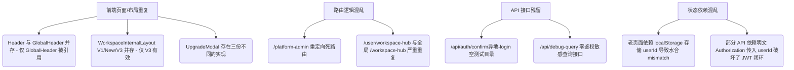

# 项目全量功能盘点与现状审计

本报告对“知阁·舟坊 (ZhiGe Dockyard) - 全栈软件研发效能操作系统”进行深度的全量功能梳理、现状审计与安全隐患分析，旨在揭示现有代码中的架构冗余、技术负债及高危越权漏洞，为下一步重构和版本迭代提供精确的参考依据。

---

## 1. 项目基础信息

### 1.1 项目技术栈
*   **前端框架**：Next.js v16.2.4 (App Router) + React v19.2.5 + React DOM v19.2.5
*   **后端/API 方式**：Next.js App Router 约定路由处理器 (`src/app/api/.../route.ts`)
*   **数据库/ORM**：MySQL 8.x + Prisma ORM v5.22.0
*   **鉴权与会话机制**：
    *   JWT (使用 `jose` v6.2.2 进行 Token 签发与强校验，加密盐来自 `JWT_SECRET`)
    *   全局中间件拦截 (`src/app/middleware.ts`)，结合 Cookie 中的 `auth_token`/`token` 与请求头 `Authorization: Bearer <token>`
    *   部分老旧模块依赖 `localStorage` 中的 `userId` 进行前端辅助渲染，这会导致 Next.js SSR 发生水合不匹配 (Hydration Mismatch)
*   **样式方案**：Tailwind CSS v4.2.2 + PostCSS + Autoprefixer，并内置了统一样式体系 (`public/zhige-design-system.html`)，页面底色固定为 `--zhige-bg-page` (#f0f8ff)，主色锁定为知性蓝 (#3182ce)
*   **主要第三方依赖**：`lucide-react` (图标库), `bcryptjs` (密码哈希加密), `uuid` (UUID 生成), `jose` (JWT 处理库)

### 1.2 项目目录结构概览
```
d:/Project Development/ZhiGe-Dockyard/zhige-dockyard-web
├── prisma/                    # Prisma 架构定义与数据库迁移脚本
│   └── schema.prisma          # 核心数据库模型定义 (MySQL 数据源)
├── docs/                      # 文档归档目录
│   ├── 工作空间执行控制台重构...   # 局部需求文档
│   └── 账号会话权限全场景详细...   # 权限场景文档
├── src/
│   ├── app/                   # App Router 路由与 API 终点
│   │   ├── admin/             # 平台全局管理后台页面 (users, workspaces, logs 等)
│   │   ├── api/               # 服务端 API 接口目录
│   │   ├── auth/              # 认证体系页面 (login, register, forgot-password 等)
│   │   ├── user/              # 用户中心页面 (profile, security, membership 等)
│   │   ├── workspace/         # 空间内部子页面 ([id]/studio, [id]/members, stats 等)
│   │   ├── workspace-hub/     # 空间中枢页面 (主 Bento 页面、create、settings)
│   │   ├── middleware.ts      # 核心全局路由与 API 鉴权/限频中间件
│   │   └── page.tsx           # 官网首页门户
│   ├── components/            # 全局 UI 组件库
│   │   ├── common/            # 通用基础 UI 组件 (AutoGrid, DataTableFilter 等)
│   │   ├── studio/            # 组件大厅与执行专属组件 (ComponentBrowser, DispatcherPanel)
│   │   └── workspace-hub/     # 空间中枢 Bento 区块组件及配套 Modal 弹窗
│   ├── constants/             # 全局静态常量 (如组件分类目录定义)
│   ├── contexts/              # 全局 React Context 上下文 (AppContext, ResponsiveContext)
│   ├── hooks/                 # 自定义 React Hooks (用以从大页面中解耦出状态逻辑)
│   ├── lib/                   # 核心公共类库
│   │   ├── prisma.ts          # Prisma 客户端单例初始化
│   │   ├── security.ts        # 全站角色、动态权限、越权防护与高危审计模块
│   │   └── auth.ts            # 密码加密校验、用户明文校验函数
│   └── types/                 # 全局 TypeScript 声明定义
└── package.json               # 依赖配置与项目启动 Scripts
```

### 1.3 当前项目启动方式
*   **Package.json Scripts 脚本**：
    *   `npm run dev`：启动 Next.js 本地热更新开发服务器 (`next dev`)。
    *   `npm run build`：执行生产环境静态优化构建 (`next build`)。
    *   `npm run start`：启动构建完成的 Next.js 生产环境 Node服务 (`next start`)。
    *   `npm run lint`：运行静态语法及规范检查 (`next lint`)。
*   **环境变量依赖 (.env)**：
    *   `DATABASE_URL`：MySQL 数据库主库连接字符串 (Prisma 依赖)。
    *   `JWT_SECRET`：JWT 签发及验证的密钥盐值。
    *   `API_RATE_LIMIT`：API 单分钟频控上限阈值（在中间件中被读取，默认 1000）。

---

## 2. 页面功能盘点

### 2.1 官网与公开页面

#### 官网首页
*   **路由**：`/`
*   **文件路径**：`src/app/page.tsx`
*   **用户状态**：未登录与登录用户皆可见。
*   **页面定位**：产品宣传门户，展示效能操作系统的核心卖点。
*   **当前主要功能**：介绍标书解析、系统设计、项目验收三大提效链路。
*   **页面上的主要操作**：点击“立即体验”跳转至 `/workspace-hub`（新版空间中枢），点击“申请 Demo”弹出联系表单，点击“查看价格”跳转至 `/pricing`。
*   **调用的 API**：无。
*   **使用的核心组件**：`HeroSection`, `CoreFeatures`, `EnterpriseSecurity`, `CTA`, `Footer`, `DemoRequestModal`。
*   **是否存在权限控制**：否，完全公开。
*   **当前问题或疑似风险**：无明显安全风险，但包含大量静态文本，部分营销功能未完成闭环。
*   **是否疑似重复页面**：否。

#### 价格方案页
*   **路由**：`/pricing`
*   **文件路径**：`src/app/pricing/page.tsx`
*   **用户状态**：未登录/登录皆可见。
*   **当前主要功能**：展示免费版、黄金版、白金版套餐的功能额度及定价。
*   **使用的核心组件**：`GlobalHeader`, `Footer`。
*   **当前问题或疑似风险**：价格支付购买流程仅能发起升级申请表单，缺乏真实在线收银台支付闭环。

#### 开发者文档与文档中心
*   **路由**：`/docs` 与 `/developers`
*   **文件路径**：`src/app/docs/page.tsx` 与 `src/app/developers/page.tsx`
*   **用户状态**：未登录/登录皆可见。
*   **当前主要功能**：展示平台使用指南与 API 开发者集成手册。
*   **调用的 API**：`/api/system-documents` (获取发布的手册列表)。
*   **当前问题或疑似风险**：页面排版较为简陋，存在极高重复性（`/docs` 和 `/developers` 呈现的内容及布局几乎完全一致）。

#### 认证中心 (登录/注册/找回密码)
*   **路由**：`/auth/login` | `/auth/register` | `/auth/forgot-password` | `/auth/cancel-deletion`
*   **文件路径**：`src/app/auth/.../page.tsx`
*   **用户状态**：未登录可见，已登录用户访问会被中间件重定向至空间中枢。
*   **页面定位**：全站统一通行证，支持手机号/邮箱/第三方 OAuth。
*   **调用的 API**：`/api/auth/login`, `/api/auth/register`, `/api/auth/send-sms`, `/api/auth/verify-sms` 等。
*   **使用核心组件**：`EmailInput`, `Toast`。
*   **安全校验**：密码强度在前端和后端进行双重校验 (`validatePasswordStrength`)，重置密码支持短信验证码二次认证。

---

### 2.2 用户中心页面

#### 用户仪表盘 / 资料管理 / 设置中心
*   **路由**：`/user/dashboard` | `/user/profile` | `/user/settings` | `/user/security` | `/user/membership` | `/user/activities` | `/user/components`
*   **文件路径**：`src/app/user/.../page.tsx`
*   **用户状态**：登录后可见。
*   **当前主要功能**：
    *   管理个人基本信息、修改头像。
    *   重置登录密码、关联多端设备。
    *   查看个人的 API 密钥列表、配置 AI 引擎偏好。
    *   展示个人名下的收藏组件、操作历史。
*   **调用的 API**：`/api/user/profile`, `/api/user/settings`, `/api/user/devices`, `/api/user/activities` 等。
*   **当前问题或疑似风险**：
    *   **高危越权漏洞**：`/user/profile` 的 API 请求在使用 `Authorization` 作为 `userId` 查询时，未与 JWT 绑定的上下文强校对，攻击者登录后可修改头部以任意用户身份拉取或修改资料。
    *   `/user/activities` 页面中显示的操作记录信息较为单一，未能全面审计所有的用户写入操作。

---

### 2.3 空间中枢页面 (Workspace Hub)

#### 空间中枢页面 (新版 Bento 布局)
*   **路由**：`/workspace-hub`
*   **文件路径**：`src/app/workspace-hub/page.tsx`
*   **用户状态**：登录后可见。
*   **页面定位**：用户管理多个个人和企业空间的仪表盘中枢。
*   **当前主要功能**：
    *   展示当前用户的基本配额信息（算力、存储、团队名额）。
    *   列出其作为所有者或成员的“个人空间”及“企业空间”。
    *   处理待处理的协作申请和审批通知。
    *   展示常用功能组件与快速通道。
*   **调用的 API**：`/api/user/workspace-hub/quota` (获取配额)、`/api/workspace/list` (拉取空间列表)、`/api/workspace/invitation/verify` 等。
*   **使用的核心组件**：大量 Bento 子组件：`UserGreeting`, `PersonalWorkspaceCard`, `EnterpriseWorkspaceList`, `ResourceOverview`, `QuickActions`, `FeaturedComponents`, `PendingSection`, 以及 Modals 中的 `CreateEnterpriseModal`, `JoinEnterpriseModal`, `UpgradeModal` 等。
*   **当前问题与风险**：与老版 `/user/workspace-hub` 高度重复。

#### 空间中枢创建空间页
*   **路由**：`/workspace-hub/create`
*   **文件路径**：`src/app/workspace-hub/create/page.tsx`
*   **当前主要功能**：向导式新建个人/企业空间。
*   **调用的 API**：`/api/workspace/create`。
*   **疑似重复**：该向导页面和中枢 Bento 主页的 `CreateEnterpriseModal` 弹窗创建逻辑完全重合。

---

### 2.4 空间内部页面

#### 空间主页 / 组件工坊 (Studio)
*   **路由**：`/workspace/[id]` (自动重定向至 `/workspace/[id]/studio`)
*   **文件路径**：`src/app/workspace/[id]/page.tsx` 与 `src/app/workspace/[id]/studio/page.tsx`
*   **用户状态**：空间成员/空间 Owner 可见。
*   **页面定位**：特定工作空间内的组件调度、装配与执行平台。
*   **页面上的主要操作**：装配组件、配置运行参数、在线 simulate 运行、查看任务运行记录、上传所需输入资料。
*   **调用的 API**：`/api/studio?action=bound`, `/api/studio?action=tasks` (拉取任务), `/api/studio?action=documents` (拉取文档), `POST /api/studio` (执行 simulate 算力扣减)。
*   **使用的核心组件**：`WorkspaceInternalLayoutV3`, `ComponentBrowser`, `ComponentDispatcherPanelNew`, `ConfirmDialog`。
*   **当前问题或疑似风险**：
    *   **高危越权风险**：`GET /api/studio?action=tasks&workspaceId=xxx` 和 `action=documents&workspaceId=xxx` 在后端接口中**完全没有检验**当前登录用户是否为该工作空间的成员，任何登录用户均可越权拉取其他空间的文档和任务日志。

#### 空间成员管理 / 空间设置 / 空间使用分析
*   **路由**：`/workspace/[id]/members` | `/workspace/[id]/settings` | `/workspace/[id]/stats` | `/workspace/[id]/components`
*   **文件路径**：`src/app/workspace/[id]/.../page.tsx`
*   **用户状态**：仅空间 Owner/Admin 可管理，Member 仅可见只读统计。
*   **当前主要功能**：
    *   邀请新成员，并为其分配空间物理角色 (ADMIN/MEMBER) 与企业岗位 (POST)。
    *   修改空间基本属性（名称、Logo、简介）。
    *   分配各岗位可操作的组件黑白名单。
    *   统计算力 Token 的消耗趋势（Barto 图表展示）。
*   **调用的 API**：`/api/workspace/kickout` (移除成员), `/api/workspace/invitation` (生成邀请码), `/api/user/workspace-hub/posts` (配置岗位) 等。
*   **使用的核心组件**：`WorkspaceInternalLayoutV3`（统领布局）。

---

### 2.5 管理后台页面 (Admin Pages)

#### 平台管理后台
*   **路由**：`/admin` (包含 `/admin/users` | `/admin/workspaces` | `/admin/components` | `/admin/membership` | `/admin/orders` | `/admin/operation-logs` | `/admin/settings` | `/admin/administrators` | `/admin/permissions` | `/admin/maintenance`)
*   **文件路径**：`src/app/admin/.../page.tsx`
*   **用户状态**：平台管理员 (PLATFORM_ADMIN) / 全局超级管理员 (SUPER_ADMIN) 可见。
*   **当前主要功能**：
    *   用户注册列表检索、一键封禁与强行清退。
    *   查看企业空间的算力配额，手动审批“升级企业空间”的申请。
    *   在商城中上架/下架组件，配置组件的价格权重。
    *   设置平台会员套餐的价格与权益。
    *   管理管理员账户，并对其分配细粒度模块权限（如 `user:read`, `workspace:read`）。
    *   一键开关“系统停机维护模式”。
*   **调用的 API**：`/api/admin/users`, `/api/admin/workspaces`, `/api/admin/components`, `/api/admin/permissions`, `/api/admin/maintenance` 等。
*   **使用的核心组件**：`AdminLayout` (内置路由拦截), `RoleMatrix`, `RoleCapabilities` 等。
*   **是否存在权限控制**：是，服务端对每个 API 都通过 `requirePlatformPermission` 进行了极其严密的校验，如果非管理员将直接返回 403 Forbidden。
*   **重复路由风险**：`/platform-admin` 路由在 Layout 中直接重定向到 `/admin`，是一个彻底死掉的无用冗余路由。

---

## 3. 组件功能盘点

### 3.1 全局布局与状态组件

| 组件名 | 文件路径 | 用途 | 关键 Props | 业务逻辑 / 是否可能需要拆分 / 重复情况 |
| :--- | :--- | :--- | :--- | :--- |
| `GlobalHeader` | `src/components/GlobalHeader.tsx` | 全局主导航栏，驱动登录态、消息轮询 | 无 | 包含消息通知列表获取逻辑。**是目前项目的主力 Header**。 |
| `Header` | `src/components/Header.tsx` | 旧版全局导航栏 | 无 | **高危冗余**：使用 localStorage 读取 userId，已被 `GlobalHeader` 取代。项目内没有任何文件引用它，可直接物理删除。 |
| `AppLayout` | `src/components/AppLayout.tsx` | 根级全局布局包装器，整合路由守卫与顶部进度条 | `children` | 决定哪些路由（如 admin、workspace、auth）需要隐藏全局 Header。 |
| `Sidebar` | `src/components/Sidebar.tsx` | 极简工作空间小边栏 | 无 | 仅包含简单的几个图标，几乎无业务逻辑。 |
| `AvatarDropdown`| `src/components/AvatarDropdown.tsx` | 头像悬浮菜单，提供个人设置/退出登录入口 | 无 | 处理登出与 AppContext 状态同步。 |
| `WorkspaceSwitcher`| `src/components/WorkspaceSwitcher.tsx` | 顶部导航内的空间一键切换组件 | 无 | 包含拉取用户空间列表、更新 lastWorkspaceId 的核心逻辑。被 `GlobalHeader` 和 `Header` 引用。 |

### 3.2 认证与权限阻断组件

| 组件名 | 文件路径 | 用途 | 被哪些页面使用 | 是否包含业务逻辑 / 重复判定 |
| :--- | :--- | :--- | :--- | :--- |
| `AuthCheck` | `src/components/AuthCheck.tsx` | 全局首屏身份核验守卫 | `AppLayout.tsx` | **核心逻辑**：拦截未登录请求并触发身份核验，重置或加载 Context 状态。 |
| `PermissionGuard`| `src/components/PermissionGuard.tsx`| 空间按钮级权限细粒度隐藏控制 | 空间内部子组件 | **纯前端控制**：基于 Props 中的权限 Key 检查当前用户的权限，若不符合则不渲染 `children`。 |
| `RouterGuards` | `src/components/RouterGuards.tsx` | 路由跳转前的强制前置规则过滤 | `AppLayout.tsx` | 用于在路由切换时拦截冷静期注销用户、踢出黑名单等。 |
| `StepUpAuthModal`| `src/components/StepUpAuthModal.tsx` | 敏感高危操作前的密码升阶验证弹窗 | 空间及后台管理 | **核心闭环**：向后端获取升阶凭证，通过后允许执行删除或重大修改。 |

### 3.3 三代 WorkspaceInternalLayout 冗余分析

| 组件名 | 用途与状态 | 文件路径 | 冗余判定 |
| :--- | :--- | :--- | :--- |
| `WorkspaceInternalLayoutV3` | **当前空间内页面唯一主力布局**。多栏自适应，集成了骨架屏、成员加入审核、岗位配置等大量 UI 交互。 | `src/components/WorkspaceInternalLayoutV3.tsx` | **有效**，目前 `/workspace/[id]/*` 路由下的 5 个功能页均统一调用此 V3 布局。 |
| `WorkspaceInternalLayoutNew` | 第二代空间布局，内含老版套餐升级弹窗。 | `src/components/WorkspaceInternalLayoutNew.tsx` | **废弃**，项目内无任何文件引用。 |
| `WorkspaceInternalLayout` | 第一代空间布局，最初的简易实现。 | `src/components/WorkspaceInternalLayout.tsx` | **废弃**，项目内无任何文件引用。 |

### 3.4 升级/申诉/协作等弹窗的重叠情况
1.  **空间升级弹窗的重叠**：
    *   `src/components/UpgradeModal.tsx`：老旧升级弹窗，被旧页面 `/user/workspace-hub` 引用。
    *   `src/components/workspace-hub/modals/UpgradeModal.tsx`：新版升级弹窗，被 Bento 空间中枢 `/workspace-hub` 引用。
    *   `src/components/WorkspaceUpgradeModal.tsx`：老版布局配套的升级弹窗（死代码，无引用）。
    *   *注：当前主力的 `WorkspaceInternalLayoutV3.tsx` 在处理空间升级时，并未引入上述任何组件，而是手写了一套 Inline Div 弹出块（代码 2035 行起）。这属于组件重构未闭环、缺乏设计系统复用的典型混乱。*
2.  **空间删除弹窗的重叠**：
    *   `src/components/DeleteWorkspaceDialog.tsx`：独立的文件，被旧版布局引用。
    *   `src/components/workspace-hub/modals/DeleteConfirmModal.tsx`：Bento 中枢配套的确认弹窗。
3.  **分享/邀请弹窗的重叠**：
    *   `src/components/ShareWorkspaceModal.tsx`：独立文件，老版逻辑。
    *   `src/components/workspace-hub/modals/ShareWorkspaceModal.tsx`：中枢配套弹窗。

### 3.5 组件工坊核心执行组件
*   `ComponentBrowser` (`src/components/studio/ComponentBrowser.tsx`)：渲染组件列表、运行态参数绑定、结果输出及操作记录展示（111k 大文件，承担了组件工坊前端的绝大部分业务）。
*   `ComponentDispatcherPanelNew` (`src/components/studio/ComponentDispatcherPanelNew.tsx`)：新版组件配置交互面板。
*   `ComponentDispatcherPanel` (`src/components/studio/ComponentDispatcherPanel.tsx`)：**老旧面板，已被 New 取代，项目内无引用。**

---

## 4. API 功能盘点

### 4.1 用户与认证相关 API

#### 个人资料接口
*   **路由**：`/api/user/profile`
*   **文件路径**：`src/app/api/user/profile/route.ts`
*   **方法**：GET / PUT
*   **是否需要登录**：是。
*   **高危安全风险**：
    *   接口使用 `request.headers.get("Authorization")?.replace("Bearer ", "")` 获取明文 `userId` 并直接作为 SQL 查询的 ID。
    *   虽然中间件拦截了该请求，但由于中间件优先支持 Cookie 中的 `auth_token` 验证（攻击者只需使用自己合法的账号登录即可生成此 Cookie），如果攻击者在发送请求时将 `Authorization` 头部手动修改为目标用户的明文 `userId`，服务端接口将会直接信任该 `userId` 并返回/修改该目标用户的敏感个人信息。
    *   **判定为高危水平越权漏洞 (BOLA)**。

#### 会员额度与配额查询接口
*   **路由**：`/api/user/workspace-hub/quota`
*   **文件路径**：`src/app/api/user/workspace-hub/quota/route.ts`
*   **方法**：GET
*   **高危安全风险**：同样使用明文 `replace("Bearer ", "")` 来确定 `userId`，存在上述相同的水平越权身份假冒风险。

---

### 4.2 工作空间相关 API

#### 工作空间列表/切换/创建
*   **路由**：`/api/workspace/list` | `/api/workspace/create` | `/api/workspace/switch`
*   **文件路径**：`src/app/api/workspace/.../route.ts`
*   **方法**：GET / POST
*   **高危安全风险**：
    *   这三个核心接口中存在相同的“双保险”退化逻辑：
        ```typescript
        // 双保险：若 Header 鉴权失败，则尝试从 Cookie 中直接读取未加密的 userId (前端在登录成功后已写入该 Cookie)
        const cookieUserId = request.cookies.get("userId")?.value;
        if (cookieUserId) {
          userId = cookieUserId;
        }
        ```
    *   `userId` Cookie 是一个完全未签名、未加密的明文 Cookie（仅由前端在登录时写入本地）。
    *   攻击者登录后，只需手动篡改本地的 `userId` Cookie（例如改成目标用户的 ID），这三个接口就会完全信任该 Cookie 中的身份，导致攻击者能够以目标用户的身份越权拉取其工作空间列表、创建新空间或任意切换空间。
    *   **判定为特大安全隐患漏洞**。

#### 空间资产统计接口
*   **路由**：`/api/workspace/assets`
*   **文件路径**：`src/app/api/workspace/assets/route.ts`
*   **方法**：GET
*   **功能**：返回用户名下所有空间的任务、文档、架构图数量。
*   **高危安全风险**：
    *   完全从 query 参数读取 `userId = searchParams.get("userId")` 并执行联表统计。
    *   接口内部没有进行任何登录态与所请求 `userId` 之间的一致性比对，任何已登录的用户都可以通过传入他人的 `userId` 来窃取他人的工作空间资产统计数据。
    *   **判定为水平越权漏洞**。

---

### 4.3 组件工坊 API

#### 组件状态及任务资料接口
*   **路由**：`/api/studio`
*   **文件路径**：`src/app/api/studio/route.ts`
*   **方法**：GET / POST
*   **高危安全风险**：
    1.  **特权调试后门**：在 `getUserId` 辅助函数中（代码 13 行）：
        ```typescript
        const testUserId = request.headers.get("X-Test-UserId");
        if (testUserId) {
          return testUserId;
        }
        ```
        如果在请求头里加入了 `X-Test-UserId: <target_userId>`，该接口就会完全跳过所有的 JWT 校验，直接判定当前登录人为该 `target_userId`。在生产环境下，这等同于给全站组件执行和任务数据拉取开了一个致命后门。
    2.  **水平越权**：当 `action=tasks` 或 `action=documents` 时，接口拉取特定工作空间下的任务日志和文档，但是**完全没有校验**当前登录用户是否为该工作空间的成员。任意登录用户只需拼接 `workspaceId`，即可拉取到该空间的所有审计记录和保密文档。

---

### 4.4 调试与临时 API

#### 模糊空间查询测试接口
*   **路由**：`/api/debug-query`
*   **文件路径**：`src/app/api/debug-query/route.ts`
*   **方法**：GET
*   **高危安全风险**：
    *   此接口属于典型的**调试残留接口**，在生产环境中没有被中间件拦截，且没有任何登录拦截。
    *   任何匿名访客访问 `/api/debug-query`，接口都会去模糊查询名称包含 "Gao" 的所有工作空间，联表返回该空间下所有的任务列表、成员数量和详情，并在出错时直接抛出包含系统路径的完整错误堆栈。
    *   **判定为高危安全隐患，应立即删除。**

---

## 5. 数据库模型盘点 (Based on schema.prisma)

基于 `prisma/schema.prisma` 定义，全站核心数据模型盘点如下：

### 5.1 用户与认证模型
*   `user`：存储全站用户的核心表。包含 role (默认 user)、membershipLevel (免费/黄金等)、status (UserStatus 枚举，活跃/封禁/注销中)、lastWorkspaceId、lastLoginIp、lastLoginDevice 等安全指标。
*   `userdevice`：设备登录记录表，限制单个账户最大登录设备数 (`deviceLimit`)，用于防范多端账号共享。
*   `loginhistory`：用户的登录日志历史。
*   `accountappeal`：用户被系统自动判定或人工封禁后的申诉记录表。
*   `apikey`：用户分发的独立 API 密钥表，用于第三方工具集成。

### 5.2 工作空间与协作模型
*   `workspace`：工作空间核心实体表。包含类型 `workspace_type` (PERSONAL 个人 / ENTERPRISE 企业)、ownerId (空间所有者)、quota (Json，旧配额配置) 以及关联套餐。
*   `workspacemember`：工作空间物理成员关联表。通过 `userId` 和 `workspaceId` 建立联合唯一约束。定义成员在空间内部的物理角色 `workspacemember_role` (OWNER / ADMIN / MEMBER)。
*   `workspaceinvitation`：协作邀请码表。包含唯一邀请 Code、过期时间、被使用状态等。
*   `workspacekickhistory`：成员被从空间内踢出的历史存根，用于管理审计。

### 5.3 岗位、动态组件及知识库模型
*   `workspacepost` (岗位表) & `postmember` (成员岗位关联表)：
    *   在企业空间协作中，为空间成员分配特定的岗位（例如系统架构师、前端开发等）。
    *   逻辑角色（如组件管理员）便是基于成员是否在 `postmember` 表中被赋予了特定的岗位来动态计算的。
*   `componentpermission`：岗位对特定组件的细粒度操作权限配置表（canView, canEdit, canDelete, canExecute），控制什么岗位可以运行什么组件。
*   `componenttask`：组件运行任务实例表。存储当前任务的执行进度 (progress)、状态 (status：pending/running/success/failed)、配置参数 (config Json) 以及最终执行结果 (result Json)。
*   `componentstats` | `componentfavorite` | `componentrating` | `componentreview`：围绕组件大厅构建的浏览、评分、评论、热度分析、收藏系统模型。
*   `document`：工作空间内部沉淀的知识文档表，支持父子层级关系，构成空间的“知识库”。
*   `asset`：工作空间中上传的文件、静态图片资源。

### 5.4 会员与算力额度模型
*   `membershiplevel`：全站会员等级及配额大纲表（定义了最大个人空间数、最大团队人数、最大存储 limit 等）。
*   `workspacequota`：每一个具体工作空间绑定的话费/算力余额配额表。存储当前空间的 Token 算力余额 (`tokenBalance`)、存储已使用量 (`storageUsed`) 以及 API 剩余调用次数。
*   `membershiporder`：会员充值/套餐购买订单表。
*   `membershipchangelog`：会员升级或降级的变更日志，用于财务核算。

---

## 6. 角色与权限现状

### 6.1 角色分层体系

#### 1. 平台级角色 (normalizePlatformRole 归一化)
*   `SUPER_ADMIN`：全局超级管理员。拥有对后台所有子模块的完全控制权（包括系统设置、管理员赋权、开关停机维护）。
*   `PLATFORM_ADMIN`：平台普通管理员。菜单和 API 的可访问性由 `src/lib/admin-permissions.json` 中配置的权限包 (如 `user:read`, `audit:read`) 进行动态限制。
*   `USER`：普通注册用户，无法访问任何管理员后台。

#### 2. 空间级物理角色 (workspacemember.role)
*   `OWNER`：空间拥有者。有权删除空间、转让空间，且不受任何组件运行限制。
*   `ADMIN`：空间管理员。有权配置空间、邀请/踢出成员、分配岗位，但无法执行 `workspace:delete`。
*   `MEMBER`：普通空间协作成员。权限受岗位限制。

#### 3. 空间级动态岗位逻辑角色 (getLogicalWorkspaceRole 计算)
*   `COMPONENT_MANAGER`：组件管理员。自动具备空间内组件安装、配置、执行与授权的所有组件权限。
*   `KNOWLEDGE_MANAGER`：知识库管理员。具备空间知识文档的增删改查及审核发布权限。
*   `VIEWER`：只读访客。对空间内的组件、文档、资源及任务仅具备 Read 只读权限。

---

### 6.2 当前角色权限表

| 角色名称 | 作用范围 | 能访问的页面路由 | 核心操作功能权限 | 存在的问题/越权隐患 |
| :--- | :--- | :--- | :--- | :--- |
| **SUPER_ADMIN** | 平台全局 | 平台后台全量路由 (`/admin/*`)前台所有页面 | 审核申诉、全局系统设置、管理员权限指派、开关维护模式 | 无明显隐患，具有最高特权。 |
| **PLATFORM_ADMIN** | 平台局部 | 根据 `admin-permissions.json` 分配的页面，其余重定向回 `/admin` | 用户管理、订单查看、组件上架下架、查看审计日志 | 后台的权限配置文件 `admin-permissions.json` 存放在本地磁盘而非数据库中，高并发下存在文件读写锁与状态不一致风险。 |
| **USER** | 个人与所加入的空间 | 官网、中枢、个人资料、所加空间内部 (`/workspace/[id]/*`) | 新建空间、在被授权岗位下执行 simulate 组件并扣减 Token | **高危越权**：可利用 API 鉴权不一致的空子，以明文 userId 冒充任意目标用户进行信息查询、删除或修改。 |
| **OWNER** (空间级) | 特定工作空间 | 空间首页、成员分配、设置页面、stats 页面 | 移除成员、分配岗位、申请升级空间套餐、删除工作空间 | 无明显隐患，只在空间内生效。 |
| **MEMBER** (空间级) | 特定工作空间 | 空间 studio 执行台、文档列表、stats 只读 | 在限制岗位外运行组件、上传资料、创建文档 | **高危越权**：可调用 API 直接拉取不属于自己的工作空间下的任务日志和所有机密文档。 |

---

## 7. 业务流程盘点

### 7.1 用户注册登录流程
1.  **步骤**：注册（校验邮箱/手机） -> 密码哈希哈希加密写入 -> 登录（生成 Session JWT，写入 Cookie `auth_token` 并同步将明文 userId 写入 `userId` Cookie）。
2.  **冷静期注销机制**：当用户在资料中提交“注销账号申请”后，账号状态变更为 `deleting` 并记录 `deletionRequestedAt`。系统提供 7 天冷静期。冷静期内登录会被中间件拦截，仅允许访问首页，并可在页面中点击“撤销注销申请”。超过 7 天后，后台在下次交互时可根据时间判定执行物理/逻辑删除。
3.  **缺失/风险**：前端往本地 Cookie 写入明文 `userId` 的操作，导致后文提及的服务端退化信任该明文 Cookie，产生了水平越权。

### 7.2 空间中枢流程
1.  **新建个人空间**：当用户首次登录并访问空间列表 API 时，系统如判定其名下尚无“个人空间”，会自动为其创建一个默认个人空间，并初始化绑定配额 `workspacequota`（自动匹配当前会员等级赋予的 Token 余额，如 FREE 等级初始化 10000 算力 Token）。
2.  **切换空间**：更新数据库中 User 的 `lastWorkspaceId` 字段，以便在下次登录或回到工作台时，自动定位到上次操作的活跃空间。

### 7.3 组件执行流程
1.  **浏览/装配**：用户在 `/workspace/[id]/studio` 下浏览已被当前空间绑定的组件大厅组件。
2.  **权限卡关**：前端组件基于 `PermissionGuard` 判定，后端在收到运行指令时，通过 `getLogicalWorkspaceRole` 综合判定成员岗位是否属于被封禁或被限制组件名单，如果不通过则阻断运行。
3.  **算力校验与扣减**：查询空间的 `workspacequota.tokenBalance` 算力余额。如余额充足，则调用 `prisma.workspacequota.update` 进行扣减（默认扣减 5 Token），并异步向 `componenttask` 中插入一条 pending 任务，随后更新进度直至成功。

---

## 8. 重复和混乱点识别

经过系统级代码扫描，梳理出以下九大重复和混乱点：



### 重复与混乱清单

| 重复/混乱类型 | 文件路径 / 路由 | 核心问题 | 安全或维护风险 | 重构改进建议 |
| :--- | :--- | :--- | :--- | :--- |
| **导航头部重复** | `src/components/Header.tsx` | 与 `GlobalHeader.tsx` 高度重复，目前已无任何文件引用。 | 混淆开发人员，且该文件内包含过时的 localStorage 鉴权逻辑。 | **物理删除** 该文件。 |
| **空间布局重复** | `src/components/WorkspaceInternalLayout.tsx` <br>`src/components/WorkspaceInternalLayoutNew.tsx` | 空间内主力布局共有三代，目前仅 V3 处于激活被引用状态。 | 产生大量废弃的死代码 (Dead Code)，使工程体积虚大。 | **物理删除** V1 和 New 版本，仅保留 V3。 |
| **升级 Modal 重叠** | `src/components/UpgradeModal.tsx` <br>`src/components/WorkspaceUpgradeModal.tsx` | 同一空间升级功能，存在新版、老板和未引用三套 Modal 实现。 | 破坏了全站设计系统的一致性，且维护困难。 | 合并为统一的 UpgradeModal 并收纳在 `src/components/common` 中，在 V3 布局中复用。 |
| **无效重定向路由** | `src/app/platform-admin` | 整个平台管理路由在 Layout 下直接重定向到 `/admin`。 | 该目录下编写的所有页面逻辑（如 workspaces）变成了永远无法被渲染的“僵尸页面”。 | 判定是否需保留该路由。若不保留，直接物理删除该目录。 |
| **空间中枢页面重复**| `src/app/user/workspace-hub/page.tsx` | 与全局的 `/workspace-hub/page.tsx` 高度重复。 | 包含陈旧的代码编写规范，在 API 调用中硬编码了本地 Token。 | **下线并删除** `/user/workspace-hub` 路由，统一导向主 `/workspace-hub`。 |
| **参数面板重复** | `src/components/studio/ComponentDispatcherPanel.tsx` | 与 New 面板高度重复，目前已无任何引用。 | 冗余文件。 | **物理删除**。 |
| **空调试目录残留** | `src/app/api/auth/confirm异地-login` | 拼写包含中英文，且为空目录。 | 命名极度不规范，破坏目录整洁度。 | **物理删除**。 |
| **未鉴权敏感接口** | `src/app/api/debug-query/route.ts` | 没有任何鉴权拦截的测试查询接口，且泄露数据。 | 任何人访问此接口皆可越权查到系统的空间、任务和成员配置。 | **立即物理删除**。 |

---

## 9. 模块完整度评分

| 业务模块名称 | 当前评分 | 已有核心功能 | 缺失的核心功能 / 缺陷 / 改进方向 | 优先级 |
| :--- | :---: | :--- | :--- | :---: |
| **未登录官网** | **4** | 首页介绍、解决方案、安全声明及价格方案静态展示。 | 解决方案和价格套餐无对应的在线交易或模拟订购流。 | 低 |
| **登录与注册** | **5** | 手机验证码登录、常规邮箱登录、冷静期账号注销、以及注册页面原生条款与政策弹窗（Modal）及全栈数据交互。 | 注册时缺乏图形验证码或滑块验证，存在被短信轰炸的风险。 | 中 |
| **新版空间中枢**| **4** | Bento 风格布局，列出空间、套餐配额概览、处理成员申请。 | 暂无。 | - |
| **个人空间管理**| **4** | 首次登录自动创建个人空间、初始化 quota 配额。 | 个人空间的资源额度隔离机制尚不够彻底。 | 中 |
| **企业空间协作**| **3** | 生成唯一邀请码、绑定岗位与物理角色、限制岗位组件。 | 服务端在分配岗位成员时，缺乏对所分配岗位是否存在的一致性校验。 | 高 |
| **组件大厅** | **4** | 浏览组件、收藏、打分、添加评论。 | 评分和打分缺乏频次控制，用户可以无限制重复刷分。 | 低 |
| **组件模拟执行**| **4** | 校验空间逻辑权限、岗位白名单，成功执行后扣减 Token。 | **存在测试特权后门 `X-Test-UserId`**，需予以剔除。 | 高 |
| **任务与日志** | **3** | 异步生成 componenttask 记录，更新进度。 | **接口 `/api/studio?action=tasks` 缺少空间归属越权校验。** | 高 |
| **知识库文档** | **3** | 在空间下创建文档、构成目录结构。 | **接口 `/api/studio?action=documents` 缺少空间归属越权校验。** | 高 |
| **平台管理后台**| **4** | 用户列表检索与封禁、空间配额审批、管理员细粒度权限指派。 | 权限配置文件直接保存在磁盘 JSON，高并发读写存隐患。 | 中 |
| **安全与审计** | **3** | 统一在 `/api` 记录 apiusage 历史、写入高危 operationlog。 | 部分关键 API 写入操作（如修改密码）未记录在审计日志中。 | 中 |

---

## 10. 高风险问题清单

### 🚨 1. 未签名明文 Cookie 信任导致的严重水平越权 (BOLA)
*   **影响接口**：`/api/workspace/list` | `/api/workspace/create` | `/api/workspace/switch`
*   **漏洞成因**：在鉴权失败的兜底分支中，接口直接读取了名为 `userId` 的 Cookie。该 Cookie 是一个完全由前端明文写入的字符串，未经过任何加密或签名。
*   **危害后果**：攻击者只需正常登录自己的账号，然后将浏览器的 `userId` Cookie 手动修改为目标受害者的 ID，发送请求即可越权查看、新建或切换属于该目标受害者的工作空间。

### 🚨 2. API 直接读取 Authorization 明文导致身份假冒
*   **影响接口**：`/api/user/profile` | `/api/user/workspace-hub/quota`
*   **漏洞成因**：接口使用 `Authorization: Bearer <token>` 头部，但是却不用 JWT 解析它，而是直接把 Bearer 后面的部分作为明文 `userId` 直接带入 Prisma SQL 查询。
*   **危害后果**：由于中间件优先从 Cookie `auth_token` 读取合法 JWT 放行，攻击者登录后，可将 `Authorization` 头部手动修改为任意目标用户的明文 `userId`，即可完美通过中间件，并在 API 层面假冒目标用户身份读取或篡改其敏感个人信息。

### 🚨 3. 组件执行接口 `/api/studio` 的测试特权后门
*   **影响接口**：`/api/studio` (GET / POST)
*   **漏洞成因**：在获取当前用户 ID 的辅助函数中，优先读取了请求头中的 `X-Test-UserId` 字段，且没有进行任何环境判断或签名校验。
*   **危害后果**：攻击者在发送请求时，只需在请求头中附加 `X-Test-UserId: <target_userId>`，系统便会完全绕过 JWT 身份核验，直接将当前会话等同于该目标用户，具有灾难性的越权漏洞隐患。

### 🚨 4. 空间任务及文档拉取缺少空间成员校验
*   **影响接口**：`/api/studio?action=tasks` | `/api/studio?action=documents`
*   **漏洞成因**：接口在拉取特定空间下的任务日志 and 文档时，仅验证了全局登录态 (是否有合法的 JWT)，但完全没有检验这个 `userId` 是否为该 `workspaceId` 的成员或 Owner。
*   **危害后果**：任意登录的用户，只需猜测或获取到他人的 `workspaceId`，即可越权拉取该空间下的所有机密文档和任务审计日志。

### 🚨 5. 调试残留接口 `/api/debug-query` 敏感数据泄露
*   **影响接口**：`/api/debug-query`
*   **漏洞成因**：该接口在开发测试完成后被遗漏在生产目录中，没有任何鉴权和访问限制。
*   **危害后果**：任何匿名用户访问此接口，均能直接模糊匹配到全网包含特定关键字的工作空间，并联表拖走其任务列表、成员详情，泄露全站敏感架构设计数据。

---

## 11. 下一步重构建议

> [!IMPORTANT]
> 以下重构措施仅作为产品规划与架构设计建议，当前未修改任何业务代码。

1.  **废弃并剔除死代码 (Dead Code)**：
    *   物理删除老旧导航 `src/components/Header.tsx`。
    *   物理删除废弃的空间布局 `WorkspaceInternalLayout.tsx` and `WorkspaceInternalLayoutNew.tsx`。
    *   物理删除废弃的 `ComponentDispatcherPanel.tsx`。
    *   物理删除废弃路由 `/user/workspace-hub`（包含 `posts` and `role-matrix` 子目录，统一迁往新版），以及停用死路由 `/platform-admin`。
2.  **统一 API 鉴权上下文，根除越权隐患**：
    *   **彻底禁用明文 Cookie 降级**：禁止在 API 接口中直接读取未签名的 `userId` Cookie。身份判定必须强制通过中间件解析 JWT payload 得到的 `x-user-id` 请求头。
    *   **规范化 Authorization 解析**：改写底层的 `validateUser` 校验逻辑，不再允许直接 replace "Bearer" 拿到明文 userId，必须对其进行 JWT 解密验证，或者统一使用中间件注入的 `x-user-id` 头作为唯一可信的当前用户身份。
    *   **下线测试后门**：立即从 `/api/studio` 中移除对 `X-Test-UserId` 头部字段的隐式信任，本地开发测试应使用专门的 Mock 文件或严格限制在 `process.env.NODE_ENV === 'development'` 且校验回环 IP 才能开启。
    *   **增补垂直与水平越权防护**：在 `/api/studio?action=tasks` 检索、`/api/workspace/assets` 统计等所有涉及空间资源的接口中，必须引入空间归属校验（即在 SQL 查询时关联 `workspacemember` 表，强校验 `userId` 是否为该 `workspaceId` 的成员）。
    *   **清理调试接口**：物理删除 `src/app/api/debug-query`，防止敏感数据泄露。
3.  **整合弹窗组件，推行组件化设计**：
    *   将散落在项目各处的 `UpgradeModal` and `DeleteWorkspaceDialog` 统一重构为单例共享组件，收纳于 `src/components/common`，并在主力 `WorkspaceInternalLayoutV3` and 中枢页面中复用，消除 Inline Modal 手写块。
