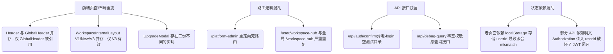

# 项目全量功能盘点与现状审计

本报告对“知阁·舟坊 (ZhiGe Dockyard) - 全栈软件研发效能操作系统”进行深度的全量功能梳理、现状审计与安全隐患分析，旨在揭示现有代码中的架构冗余、技术负债及高危越权漏洞，为下一步重构和版本迭代提供精确的参考依据。

---

## 1. 项目基础信息

### 1.1 项目技术栈
*   **前端框架**：Next.js v16.2.4 (App Router) + React v19.2.5 + React DOM v19.2.5
*   **后端/API 方式**：Next.js App Router 约定路由处理器 (`src/app/api/.../route.ts`)
*   **数据库/ORM**：MySQL 8.x + Prisma ORM v5.22.0
*   **鉴权与会话机制**：
    *   JWT (使用 `jose` v6.2.2 进行 Token 签发与强校验，加密盐来自 `JWT_SECRET`)
    *   全局中间件拦截 (`src/app/middleware.ts`)，结合 Cookie 中的 `auth_token`/`token` 与请求头 `Authorization: Bearer <token>`
    *   部分老旧模块依赖 `localStorage` 中的 `userId` 进行前端辅助渲染，这会导致 Next.js SSR 发生水合不匹配 (Hydration Mismatch)
*   **样式方案**：Tailwind CSS v4.2.2 + PostCSS + Autoprefixer，并内置了统一样式体系 (`public/zhige-design-system.html`)，页面底色固定为 `--zhige-bg-page` (#f0f8ff)，主色锁定为知性蓝 (#3182ce)
*   **主要第三方依赖**：`lucide-react` (图标库), `bcryptjs` (密码哈希加密), `uuid` (UUID 生成), `jose` (JWT 处理库)

### 1.2 项目目录结构概览
```
d:/Project Development/ZhiGe-Dockyard/zhige-dockyard-web
├── prisma/                    # Prisma 架构定义与数据库迁移脚本
│   └── schema.prisma          # 核心数据库模型定义 (MySQL 数据源)
├── docs/                      # 文档归档目录
│   ├── 工作空间执行控制台重构...   # 局部需求文档
│   └── 账号会话权限全场景详细...   # 权限场景文档
├── src/
│   ├── app/                   # App Router 路由与 API 终点
│   │   ├── admin/             # 平台全局管理后台页面 (users, workspaces, logs 等)
│   │   ├── api/               # 服务端 API 接口目录
│   │   ├── auth/              # 认证体系页面 (login, register, forgot-password 等)
│   │   ├── user/              # 用户中心页面 (profile, security, membership 等)
│   │   ├── workspace/         # 空间内部子页面 ([id]/studio, [id]/members, stats 等)
│   │   ├── workspace-hub/     # 空间中枢页面 (主 Bento 页面、create、settings)
│   │   ├── middleware.ts      # 核心全局路由与 API 鉴权/限频中间件
│   │   └── page.tsx           # 官网首页门户
│   ├── components/            # 全局 UI 组件库
│   │   ├── common/            # 通用基础 UI 组件 (AutoGrid, DataTableFilter 等)
│   │   ├── studio/            # 组件大厅与执行专属组件 (ComponentBrowser, DispatcherPanel)
│   │   └── workspace-hub/     # 空间中枢 Bento 区块组件及配套 Modal 弹窗
│   ├── constants/             # 全局静态常量 (如组件分类目录定义)
│   ├── contexts/              # 全局 React Context 上下文 (AppContext, ResponsiveContext)
│   ├── hooks/                 # 自定义 React Hooks (用以从大页面中解耦出状态逻辑)
│   ├── lib/                   # 核心公共类库
│   │   ├── prisma.ts          # Prisma 客户端单例初始化
│   │   ├── security.ts        # 全站角色、动态权限、越权防护与高危审计模块
│   │   └── auth.ts            # 密码加密校验、用户明文校验函数
│   └── types/                 # 全局 TypeScript 声明定义
└── package.json               # 依赖配置与项目启动 Scripts
```

### 1.3 当前项目启动方式
*   **Package.json Scripts 脚本**：
    *   `npm run dev`：启动 Next.js 本地热更新开发服务器 (`next dev`)。
    *   `npm run build`：执行生产环境静态优化构建 (`next build`)。
    *   `npm run start`：启动构建完成的 Next.js 生产环境 Node服务 (`next start`)。
    *   `npm run lint`：运行静态语法及规范检查 (`next lint`)。
*   **环境变量依赖 (.env)**：
    *   `DATABASE_URL`：MySQL 数据库主库连接字符串 (Prisma 依赖)。
    *   `JWT_SECRET`：JWT 签发及验证的密钥盐值。
    *   `API_RATE_LIMIT`：API 单分钟频控上限阈值（在中间件中被读取，默认 1000）。

---

## 2. 页面功能盘点

### 2.1 官网与公开页面

#### 官网首页
*   **路由**：`/`
*   **文件路径**：`src/app/page.tsx`
*   **用户状态**：未登录与登录用户皆可见。
*   **页面定位**：产品宣传门户，展示效能操作系统的核心卖点。
*   **当前主要功能**：介绍标书解析、系统设计、项目验收三大提效链路。
*   **页面上的主要操作**：点击“立即体验”跳转至 `/workspace-hub`（新版空间中枢），点击“申请 Demo”弹出联系表单，点击“查看价格”跳转至 `/pricing`。
*   **调用的 API**：无。
*   **使用的核心组件**：`HeroSection`, `CoreFeatures`, `EnterpriseSecurity`, `CTA`, `Footer`, `DemoRequestModal`。
*   **是否存在权限控制**：否，完全公开。
*   **当前问题或疑似风险**：无明显安全风险，但包含大量静态文本，部分营销功能未完成闭环。
*   **是否疑似重复页面**：否。

#### 价格方案页
*   **路由**：`/pricing`
*   **文件路径**：`src/app/pricing/page.tsx`
*   **用户状态**：未登录/登录皆可见。
*   **当前主要功能**：展示免费版、黄金版、白金版套餐的功能额度及定价。
*   **使用的核心组件**：`GlobalHeader`, `Footer`。
*   **当前问题或疑似风险**：价格支付购买流程仅能发起升级申请表单，缺乏真实在线收银台支付闭环。

#### 开发者文档与文档中心
*   **路由**：`/docs` 与 `/developers`
*   **文件路径**：`src/app/docs/page.tsx` 与 `src/app/developers/page.tsx`
*   **用户状态**：未登录/登录皆可见。
*   **当前主要功能**：展示平台使用指南与 API 开发者集成手册。
*   **调用的 API**：`/api/system-documents` (获取发布的手册列表)。
*   **当前问题或疑似风险**：页面排版较为简陋，存在极高重复性（`/docs` 和 `/developers` 呈现的内容及布局几乎完全一致）。

#### 认证中心 (登录/注册/找回密码)
*   **路由**：`/auth/login` | `/auth/register` | `/auth/forgot-password` | `/auth/cancel-deletion`
*   **文件路径**：`src/app/auth/.../page.tsx`
*   **用户状态**：未登录可见，已登录用户访问会被中间件重定向至空间中枢。
*   **页面定位**：全站统一通行证，支持手机号/邮箱/第三方 OAuth。
*   **调用的 API**：`/api/auth/login`, `/api/auth/register`, `/api/auth/send-sms`, `/api/auth/verify-sms` 等。
*   **使用核心组件**：`EmailInput`, `Toast`。
*   **安全校验**：密码强度在前端和后端进行双重校验 (`validatePasswordStrength`)，重置密码支持短信验证码二次认证。

---

### 2.2 用户中心页面

#### 用户仪表盘 / 资料管理 / 设置中心
*   **路由**：`/user/dashboard` | `/user/profile` | `/user/settings` | `/user/security` | `/user/membership` | `/user/activities` | `/user/components`
*   **文件路径**：`src/app/user/.../page.tsx`
*   **用户状态**：登录后可见。
*   **当前主要功能**：
    *   管理个人基本信息、修改头像。
    *   重置登录密码、关联多端设备。
    *   查看个人的 API 密钥列表、配置 AI 引擎偏好。
    *   展示个人名下的收藏组件、操作历史。
*   **调用的 API**：`/api/user/profile`, `/api/user/settings`, `/api/user/devices`, `/api/user/activities` 等。
*   **当前问题或疑似风险**：
    *   **高危越权漏洞**：`/user/profile` 的 API 请求在使用 `Authorization` 作为 `userId` 查询时，未与 JWT 绑定的上下文强校对，攻击者登录后可修改头部以任意用户身份拉取或修改资料。
    *   `/user/activities` 页面中显示的操作记录信息较为单一，未能全面审计所有的用户写入操作。

---

### 2.3 空间中枢页面 (Workspace Hub)

#### 空间中枢页面 (新版 Bento 布局)
*   **路由**：`/workspace-hub`
*   **文件路径**：`src/app/workspace-hub/page.tsx`
*   **用户状态**：登录后可见。
*   **页面定位**：用户管理多个个人和企业空间的仪表盘中枢。
*   **当前主要功能**：
    *   展示当前用户的基本配额信息（算力、存储、团队名额）。
    *   列出其作为所有者或成员的“个人空间”及“企业空间”。
    *   处理待处理的协作申请和审批通知。
    *   展示常用功能组件与快速通道。
*   **调用的 API**：`/api/user/workspace-hub/quota` (获取配额)、`/api/workspace/list` (拉取空间列表)、`/api/workspace/invitation/verify` 等。
*   **使用的核心组件**：大量 Bento 子组件：`UserGreeting`, `PersonalWorkspaceCard`, `EnterpriseWorkspaceList`, `ResourceOverview`, `QuickActions`, `FeaturedComponents`, `PendingSection`, 以及 Modals 中的 `CreateEnterpriseModal`, `JoinEnterpriseModal`, `UpgradeModal` 等。
*   **当前问题与风险**：与老版 `/user/workspace-hub` 高度重复。

#### 空间中枢创建空间页
*   **路由**：`/workspace-hub/create`
*   **文件路径**：`src/app/workspace-hub/create/page.tsx`
*   **当前主要功能**：向导式新建个人/企业空间。
*   **调用的 API**：`/api/workspace/create`。
*   **疑似重复**：该向导页面和中枢 Bento 主页的 `CreateEnterpriseModal` 弹窗创建逻辑完全重合。

---

### 2.4 空间内部页面

#### 空间主页 / 组件工坊 (Studio)
*   **路由**：`/workspace/[id]` (自动重定向至 `/workspace/[id]/studio`)
*   **文件路径**：`src/app/workspace/[id]/page.tsx` 与 `src/app/workspace/[id]/studio/page.tsx`
*   **用户状态**：空间成员/空间 Owner 可见。
*   **页面定位**：特定工作空间内的组件调度、装配与执行平台。
*   **页面上的主要操作**：装配组件、配置运行参数、在线 simulate 运行、查看任务运行记录、上传所需输入资料。
*   **调用的 API**：`/api/studio?action=bound`, `/api/studio?action=tasks` (拉取任务), `/api/studio?action=documents` (拉取文档), `POST /api/studio` (执行 simulate 算力扣减)。
*   **使用的核心组件**：`WorkspaceInternalLayoutV3`, `ComponentBrowser`, `ComponentDispatcherPanelNew`, `ConfirmDialog`。
*   **当前问题或疑似风险**：
    *   **高危越权风险**：`GET /api/studio?action=tasks&workspaceId=xxx` 和 `action=documents&workspaceId=xxx` 在后端接口中**完全没有检验**当前登录用户是否为该工作空间的成员，任何登录用户均可越权拉取其他空间的文档和任务日志。

#### 空间成员管理 / 空间设置 / 空间使用分析
*   **路由**：`/workspace/[id]/members` | `/workspace/[id]/settings` | `/workspace/[id]/stats` | `/workspace/[id]/components`
*   **文件路径**：`src/app/workspace/[id]/.../page.tsx`
*   **用户状态**：仅空间 Owner/Admin 可管理，Member 仅可见只读统计。
*   **当前主要功能**：
    *   邀请新成员，并为其分配空间物理角色 (ADMIN/MEMBER) 与企业岗位 (POST)。
    *   修改空间基本属性（名称、Logo、简介）。
    *   分配各岗位可操作的组件黑白名单。
    *   统计算力 Token 的消耗趋势（Barto 图表展示）。
*   **调用的 API**：`/api/workspace/kickout` (移除成员), `/api/workspace/invitation` (生成邀请码), `/api/user/workspace-hub/posts` (配置岗位) 等。
*   **使用的核心组件**：`WorkspaceInternalLayoutV3`（统领布局）。

---

### 2.5 管理后台页面 (Admin Pages)

#### 平台管理后台
*   **路由**：`/admin` (包含 `/admin/users` | `/admin/workspaces` | `/admin/components` | `/admin/membership` | `/admin/orders` | `/admin/operation-logs` | `/admin/settings` | `/admin/administrators` | `/admin/permissions` | `/admin/maintenance`)
*   **文件路径**：`src/app/admin/.../page.tsx`
*   **用户状态**：平台管理员 (PLATFORM_ADMIN) / 全局超级管理员 (SUPER_ADMIN) 可见。
*   **当前主要功能**：
    *   用户注册列表检索、一键封禁与强行清退。
    *   查看企业空间的算力配额，手动审批“升级企业空间”的申请。
    *   在商城中上架/下架组件，配置组件的价格权重。
    *   设置平台会员套餐的价格与权益。
    *   管理管理员账户，并对其分配细粒度模块权限（如 `user:read`, `workspace:read`）。
    *   一键开关“系统停机维护模式”。
    *   **操作审计与流水追踪 (`/admin/operation-logs`)**：
        *   **自然业务语言收敛**：杜绝底层机器计数器堆叠。针对批量操作（如批量封禁、批量解封、批量强制下线），将分散的 `totalSelected/processedCount/skippedCount/failedCount/skippedSample` 智能收敛为【批量处理结果】（如“共勾选 3 项：成功处理 1 项，跳过 2 项”）、【跳过处理说明】（自动提取 skippedSample 中去重后的具体业务案由）、【执行范围模式】（手动勾选/全选范围）以及【操作原因】等 2~3 个大白话业务卡片。
        *   **状态变更精准定性**：将单一状态修改（如 `status: inactive`）精准定性为“停用用户账号”，并以“变更后账号状态：已停用 (未激活)”展示，消灭“业务变更内容：业务状态：未激活”的生硬套娃，禁止误标为笼统的“修改用户资料”。
        *   **彻底消除机器乱码代号**：禁止截取 cuid 字符串生成如 `用户 (lxoy)`、`用户 (s1i7)` 这类无意义机器代号；优先关联数据库实体真实姓名与邮箱，查不到时统一优雅降级为“目标用户账号”。
        *   **全量中文词根映射与非硬编码双引擎**：拒绝简单写死字典的硬编码做法。建立底层通用动态转译架构：
            1. 键名动态分词引擎 (`translateFieldKeyToChinese`)：支持对任意未知驼峰/下划线键名（如 `paymentMethod`, `sourceTaskId`, `reviewComment` 等）进行拆解与通用词根匹配，确保未来新增任意业务字段均 100% 自动翻译为标准中文业务标签；
            2. 数据值智能转译引擎 (`translateValueToChinese`)：将真实数据根据业务类型进行人性化数据呈现，包括 ISO 时间自动格式化为标准年月日时分秒、数字自动补全“算力点/项/¥”计量单位、布尔值按业务语境转为“已公开上架/已启用/是/否”、复杂嵌套对象及数组提炼自然语言（彻底消灭 `[object Object]`）、长机器 ID 结合数据库实体自动降级脱敏。整个详情弹窗 100% 纯中文、零硬编码、真实数据化呈现。
*   **调用的 API**：`/api/admin/users`, `/api/admin/workspaces`, `/api/admin/components`, `/api/admin/permissions`, `/api/admin/maintenance`, `/api/admin/operation-logs` 等。
*   **使用的核心组件**：`AdminLayout` (内置路由拦截), `RoleMatrix`, `RoleCapabilities`, `Pagination`, `useToast` 等。
*   **是否存在权限控制**：是，服务端对每个 API 都通过 `requirePlatformPermission` 进行了极其严密的校验，如果非管理员将直接返回 403 Forbidden。
*   **重复路由风险**：`/platform-admin` 路由在 Layout 中直接重定向到 `/admin`，是一个彻底死掉的无用冗余路由。

---

## 3. 组件功能盘点

### 3.1 全局布局与状态组件

| 组件名 | 文件路径 | 用途 | 关键 Props | 业务逻辑 / 是否可能需要拆分 / 重复情况 |
| :--- | :--- | :--- | :--- | :--- |
| `GlobalHeader` | `src/components/GlobalHeader.tsx` | 全局主导航栏，驱动登录态、消息轮询 | 无 | 包含消息通知列表获取逻辑。**是目前项目的主力 Header**。 |
| `Header` | `src/components/Header.tsx` | 旧版全局导航栏 | 无 | **高危冗余**：使用 localStorage 读取 userId，已被 `GlobalHeader` 取代。项目内没有任何文件引用它，可直接物理删除。 |
| `AppLayout` | `src/components/AppLayout.tsx` | 根级全局布局包装器，整合路由守卫与顶部进度条 | `children` | 决定哪些路由（如 admin、workspace、auth）需要隐藏全局 Header。 |
| `Sidebar` | `src/components/Sidebar.tsx` | 极简工作空间小边栏 | 无 | 仅包含简单的几个图标，几乎无业务逻辑。 |
| `AvatarDropdown`| `src/components/AvatarDropdown.tsx` | 头像悬浮菜单，提供个人设置/退出登录入口 | 无 | 处理登出与 AppContext 状态同步。 |
| `WorkspaceSwitcher`| `src/components/WorkspaceSwitcher.tsx` | 顶部导航内的空间一键切换组件 | 无 | 包含拉取用户空间列表、更新 lastWorkspaceId 的核心逻辑。被 `GlobalHeader` 和 `Header` 引用。 |

### 3.2 认证与权限阻断组件

| 组件名 | 文件路径 | 用途 | 被哪些页面使用 | 是否包含业务逻辑 / 重复判定 |
| :--- | :--- | :--- | :--- | :--- |
| `AuthCheck` | `src/components/AuthCheck.tsx` | 全局首屏身份核验守卫 | `AppLayout.tsx` | **核心逻辑**：拦截未登录请求并触发身份核验，重置或加载 Context 状态。 |
| `PermissionGuard`| `src/components/PermissionGuard.tsx`| 空间按钮级权限细粒度隐藏控制 | 空间内部子组件 | **纯前端控制**：基于 Props 中的权限 Key 检查当前用户的权限，若不符合则不渲染 `children`。 |
| `RouterGuards` | `src/components/RouterGuards.tsx` | 路由跳转前的强制前置规则过滤 | `AppLayout.tsx` | 用于在路由切换时拦截冷静期注销用户、踢出黑名单等。 |
| `StepUpAuthModal`| `src/components/StepUpAuthModal.tsx` | 敏感高危操作前的密码升阶验证弹窗 | 空间及后台管理 | **核心闭环**：向后端获取升阶凭证，通过后允许执行删除或重大修改。 |

### 3.3 三代 WorkspaceInternalLayout 冗余分析

| 组件名 | 用途与状态 | 文件路径 | 冗余判定 |
| :--- | :--- | :--- | :--- |
| `WorkspaceInternalLayoutV3` | **当前空间内页面唯一主力布局**。多栏自适应，集成了骨架屏、成员加入审核、岗位配置等大量 UI 交互。 | `src/components/WorkspaceInternalLayoutV3.tsx` | **有效**，目前 `/workspace/[id]/*` 路由下的 5 个功能页均统一调用此 V3 布局。 |
| `WorkspaceInternalLayoutNew` | 第二代空间布局，内含老版套餐升级弹窗。 | `src/components/WorkspaceInternalLayoutNew.tsx` | **废弃**，项目内无任何文件引用。 |
| `WorkspaceInternalLayout` | 第一代空间布局，最初的简易实现。 | `src/components/WorkspaceInternalLayout.tsx` | **废弃**，项目内无任何文件引用。 |

### 3.4 升级/申诉/协作等弹窗的重叠情况
1.  **空间升级弹窗的重叠**：
    *   `src/components/UpgradeModal.tsx`：老旧升级弹窗，被旧页面 `/user/workspace-hub` 引用。
    *   `src/components/workspace-hub/modals/UpgradeModal.tsx`：新版升级弹窗，被 Bento 空间中枢 `/workspace-hub` 引用。
    *   `src/components/WorkspaceUpgradeModal.tsx`：老版布局配套的升级弹窗（死代码，无引用）。
    *   *注：当前主力的 `WorkspaceInternalLayoutV3.tsx` 在处理空间升级时，并未引入上述任何组件，而是手写了一套 Inline Div 弹出块（代码 2035 行起）。这属于组件重构未闭环、缺乏设计系统复用的典型混乱。*
2.  **空间删除弹窗的重叠**：
    *   `src/components/DeleteWorkspaceDialog.tsx`：独立的文件，被旧版布局引用。
    *   `src/components/workspace-hub/modals/DeleteConfirmModal.tsx`：Bento 中枢配套的确认弹窗。
3.  **分享/邀请弹窗的重叠**：
    *   `src/components/ShareWorkspaceModal.tsx`：独立文件，老版逻辑。
    *   `src/components/workspace-hub/modals/ShareWorkspaceModal.tsx`：中枢配套弹窗。

### 3.5 组件工坊核心执行组件
*   `ComponentBrowser` (`src/components/studio/ComponentBrowser.tsx`)：渲染组件列表、运行态参数绑定、结果输出及操作记录展示（111k 大文件，承担了组件工坊前端的绝大部分业务）。
*   `ComponentDispatcherPanelNew` (`src/components/studio/ComponentDispatcherPanelNew.tsx`)：新版组件配置交互面板。
*   `ComponentDispatcherPanel` (`src/components/studio/ComponentDispatcherPanel.tsx`)：**老旧面板，已被 New 取代，项目内无引用。**

---

## 4. API 功能盘点

### 4.1 用户与认证相关 API

#### 个人资料接口
*   **路由**：`/api/user/profile`
*   **文件路径**：`src/app/api/user/profile/route.ts`
*   **方法**：GET / PUT
*   **是否需要登录**：是。
*   **高危安全风险**：
    *   接口使用 `request.headers.get("Authorization")?.replace("Bearer ", "")` 获取明文 `userId` 并直接作为 SQL 查询的 ID。
    *   虽然中间件拦截了该请求，但由于中间件优先支持 Cookie 中的 `auth_token` 验证（攻击者只需使用自己合法的账号登录即可生成此 Cookie），如果攻击者在发送请求时将 `Authorization` 头部手动修改为目标用户的明文 `userId`，服务端接口将会直接信任该 `userId` 并返回/修改该目标用户的敏感个人信息。
    *   **判定为高危水平越权漏洞 (BOLA)**。

#### 会员额度与配额查询接口
*   **路由**：`/api/user/workspace-hub/quota`
*   **文件路径**：`src/app/api/user/workspace-hub/quota/route.ts`
*   **方法**：GET
*   **高危安全风险**：同样使用明文 `replace("Bearer ", "")` 来确定 `userId`，存在上述相同的水平越权身份假冒风险。

---

### 4.2 工作空间相关 API

#### 工作空间列表/切换/创建
*   **路由**：`/api/workspace/list` | `/api/workspace/create` | `/api/workspace/switch`
*   **文件路径**：`src/app/api/workspace/.../route.ts`
*   **方法**：GET / POST
*   **高危安全风险**：
    *   这三个核心接口中存在相同的“双保险”退化逻辑：
        ```typescript
        // 双保险：若 Header 鉴权失败，则尝试从 Cookie 中直接读取未加密的 userId (前端在登录成功后已写入该 Cookie)
        const cookieUserId = request.cookies.get("userId")?.value;
        if (cookieUserId) {
          userId = cookieUserId;
        }
        ```
    *   `userId` Cookie 是一个完全未签名、未加密的明文 Cookie（仅由前端在登录时写入本地）。
    *   攻击者登录后，只需手动篡改本地的 `userId` Cookie（例如改成目标用户的 ID），这三个接口就会完全信任该 Cookie 中的身份，导致攻击者能够以目标用户的身份越权拉取其工作空间列表、创建新空间或任意切换空间。
    *   **判定为特大安全隐患漏洞**。

#### 空间资产统计接口
*   **路由**：`/api/workspace/assets`
*   **文件路径**：`src/app/api/workspace/assets/route.ts`
*   **方法**：GET
*   **功能**：返回用户名下所有空间的任务、文档、架构图数量。
*   **高危安全风险**：
    *   完全从 query 参数读取 `userId = searchParams.get("userId")` 并执行联表统计。
    *   接口内部没有进行任何登录态与所请求 `userId` 之间的一致性比对，任何已登录的用户都可以通过传入他人的 `userId` 来窃取他人的工作空间资产统计数据。
    *   **判定为水平越权漏洞**。

---

### 4.3 组件工坊 API

#### 组件状态及任务资料接口
*   **路由**：`/api/studio`
*   **文件路径**：`src/app/api/studio/route.ts`
*   **方法**：GET / POST
*   **高危安全风险**：
    1.  **特权调试后门**：在 `getUserId` 辅助函数中（代码 13 行）：
        ```typescript
        const testUserId = request.headers.get("X-Test-UserId");
        if (testUserId) {
          return testUserId;
        }
        ```
        如果在请求头里加入了 `X-Test-UserId: <target_userId>`，该接口就会完全跳过所有的 JWT 校验，直接判定当前登录人为该 `target_userId`。在生产环境下，这等同于给全站组件执行和任务数据拉取开了一个致命后门。
    2.  **水平越权**：当 `action=tasks` 或 `action=documents` 时，接口拉取特定工作空间下的任务日志和文档，但是**完全没有校验**当前登录用户是否为该工作空间的成员。任意登录用户只需拼接 `workspaceId`，即可拉取到该空间的所有审计记录和保密文档。

---

### 4.4 调试与临时 API

#### 模糊空间查询测试接口
*   **路由**：`/api/debug-query`
*   **文件路径**：`src/app/api/debug-query/route.ts`
*   **方法**：GET
*   **高危安全风险**：
    *   此接口属于典型的**调试残留接口**，在生产环境中没有被中间件拦截，且没有任何登录拦截。
    *   任何匿名访客访问 `/api/debug-query`，接口都会去模糊查询名称包含 "Gao" 的所有工作空间，联表返回该空间下所有的任务列表、成员数量和详情，并在出错时直接抛出包含系统路径的完整错误堆栈。
    *   **判定为高危安全隐患，应立即删除。**

---

## 5. 数据库模型盘点 (Based on schema.prisma)

基于 `prisma/schema.prisma` 定义，全站核心数据模型盘点如下：

### 5.1 用户与认证模型
*   `user`：存储全站用户的核心表。包含 role (默认 user)、membershipLevel (免费/黄金等)、status (UserStatus 枚举，活跃/封禁/注销中)、lastWorkspaceId、lastLoginIp、lastLoginDevice 等安全指标。
*   `userdevice`：设备登录记录表，限制单个账户最大登录设备数 (`deviceLimit`)，用于防范多端账号共享。
*   `loginhistory`：用户的登录日志历史。
*   `accountappeal`：用户被系统自动判定或人工封禁后的申诉记录表。
*   `apikey`：用户分发的独立 API 密钥表，用于第三方工具集成。

### 5.2 工作空间与协作模型
*   `workspace`：工作空间核心实体表。包含类型 `workspace_type` (PERSONAL 个人 / ENTERPRISE 企业)、ownerId (空间所有者)、quota (Json，旧配额配置) 以及关联套餐。
*   `workspacemember`：工作空间物理成员关联表。通过 `userId` 和 `workspaceId` 建立联合唯一约束。定义成员在空间内部的物理角色 `workspacemember_role` (OWNER / ADMIN / MEMBER)。
*   `workspaceinvitation`：协作邀请码表。包含唯一邀请 Code、过期时间、被使用状态等。
*   `workspacekickhistory`：成员被从空间内踢出的历史存根，用于管理审计。

### 5.3 岗位、动态组件及知识库模型
*   `workspacepost` (岗位表) & `postmember` (成员岗位关联表)：
    *   在企业空间协作中，为空间成员分配特定的岗位（例如系统架构师、前端开发等）。
    *   逻辑角色（如组件管理员）便是基于成员是否在 `postmember` 表中被赋予了特定的岗位来动态计算的。
*   `componentpermission`：岗位对特定组件的细粒度操作权限配置表（canView, canEdit, canDelete, canExecute），控制什么岗位可以运行什么组件。
*   `componenttask`：组件运行任务实例表。存储当前任务的执行进度 (progress)、状态 (status：pending/running/success/failed)、配置参数 (config Json) 以及最终执行结果 (result Json)。
*   `componentstats` | `componentfavorite` | `componentrating` | `componentreview`：围绕组件大厅构建的浏览、评分、评论、热度分析、收藏系统模型。
*   `document`：工作空间内部沉淀的知识文档表，支持父子层级关系，构成空间的“知识库”。
*   `asset`：工作空间中上传的文件、静态图片资源。

### 5.4 会员与算力额度模型
*   `membershiplevel`：全站会员等级及配额大纲表（定义了最大个人空间数、最大团队人数、最大存储 limit 等）。
*   `workspacequota`：每一个具体工作空间绑定的话费/算力余额配额表。存储当前空间的 Token 算力余额 (`tokenBalance`)、存储已使用量 (`storageUsed`) 以及 API 剩余调用次数。
*   `membershiporder`：会员充值/套餐购买订单表。
*   `membershipchangelog`：会员升级或降级的变更日志，用于财务核算。

---

## 6. 角色与权限现状

### 6.1 角色分层体系

#### 1. 平台级角色 (normalizePlatformRole 归一化)
*   `SUPER_ADMIN`：全局超级管理员。拥有对后台所有子模块的完全控制权（包括系统设置、管理员赋权、开关停机维护）。
*   `PLATFORM_ADMIN`：平台普通管理员。菜单和 API 的可访问性由 `src/lib/admin-permissions.json` 中配置的权限包 (如 `user:read`, `audit:read`) 进行动态限制。
*   `USER`：普通注册用户，无法访问任何管理员后台。

#### 2. 空间级物理角色 (workspacemember.role)
*   `OWNER`：空间拥有者。有权删除空间、转让空间，且不受任何组件运行限制。
*   `ADMIN`：空间管理员。有权配置空间、邀请/踢出成员、分配岗位，但无法执行 `workspace:delete`。
*   `MEMBER`：普通空间协作成员。权限受岗位限制。

#### 3. 空间级动态岗位逻辑角色 (getLogicalWorkspaceRole 计算)
*   `COMPONENT_MANAGER`：组件管理员。自动具备空间内组件安装、配置、执行与授权的所有组件权限。
*   `KNOWLEDGE_MANAGER`：知识库管理员。具备空间知识文档的增删改查及审核发布权限。
*   `VIEWER`：只读访客。对空间内的组件、文档、资源及任务仅具备 Read 只读权限。

---

### 6.2 当前角色权限表

| 角色名称 | 作用范围 | 能访问的页面路由 | 核心操作功能权限 | 存在的问题/越权隐患 |
| :--- | :--- | :--- | :--- | :--- |
| **SUPER_ADMIN** | 平台全局 | 平台后台全量路由 (`/admin/*`)前台所有页面 | 审核申诉、全局系统设置、管理员权限指派、开关维护模式 | 无明显隐患，具有最高特权。 |
| **PLATFORM_ADMIN** | 平台局部 | 根据 `admin-permissions.json` 分配的页面，其余重定向回 `/admin` | 用户管理、订单查看、组件上架下架、查看审计日志 | 后台的权限配置文件 `admin-permissions.json` 存放在本地磁盘而非数据库中，高并发下存在文件读写锁与状态不一致风险。 |
| **USER** | 个人与所加入的空间 | 官网、中枢、个人资料、所加空间内部 (`/workspace/[id]/*`) | 新建空间、在被授权岗位下执行 simulate 组件并扣减 Token | **高危越权**：可利用 API 鉴权不一致的空子，以明文 userId 冒充任意目标用户进行信息查询、删除或修改。 |
| **OWNER** (空间级) | 特定工作空间 | 空间首页、成员分配、设置页面、stats 页面 | 移除成员、分配岗位、申请升级空间套餐、删除工作空间 | 无明显隐患，只在空间内生效。 |
| **MEMBER** (空间级) | 特定工作空间 | 空间 studio 执行台、文档列表、stats 只读 | 在限制岗位外运行组件、上传资料、创建文档 | **高危越权**：可调用 API 直接拉取不属于自己的工作空间下的任务日志和所有机密文档。 |

---

## 7. 业务流程盘点

### 7.1 用户注册登录流程
1.  **步骤**：注册（校验邮箱/手机） -> 密码哈希哈希加密写入 -> 登录（生成 Session JWT，写入 Cookie `auth_token` 并同步将明文 userId 写入 `userId` Cookie）。
2.  **冷静期注销机制**：当用户在资料中提交“注销账号申请”后，账号状态变更为 `deleting` 并记录 `deletionRequestedAt`。系统提供 7 天冷静期。冷静期内登录会被中间件拦截，仅允许访问首页，并可在页面中点击“撤销注销申请”。超过 7 天后，后台在下次交互时可根据时间判定执行物理/逻辑删除。
3.  **缺失/风险**：前端往本地 Cookie 写入明文 `userId` 的操作，导致后文提及的服务端退化信任该明文 Cookie，产生了水平越权。

### 7.2 空间中枢流程
1.  **新建个人空间**：当用户首次登录并访问空间列表 API 时，系统如判定其名下尚无“个人空间”，会自动为其创建一个默认个人空间，并初始化绑定配额 `workspacequota`（自动匹配当前会员等级赋予的 Token 余额，如 FREE 等级初始化 10000 算力 Token）。
2.  **切换空间**：更新数据库中 User 的 `lastWorkspaceId` 字段，以便在下次登录或回到工作台时，自动定位到上次操作的活跃空间。

### 7.3 组件执行流程
1.  **浏览/装配**：用户在 `/workspace/[id]/studio` 下浏览已被当前空间绑定的组件大厅组件。
2.  **权限卡关**：前端组件基于 `PermissionGuard` 判定，后端在收到运行指令时，通过 `getLogicalWorkspaceRole` 综合判定成员岗位是否属于被封禁或被限制组件名单，如果不通过则阻断运行。
3.  **算力校验与扣减**：查询空间的 `workspacequota.tokenBalance` 算力余额。如余额充足，则调用 `prisma.workspacequota.update` 进行扣减（默认扣减 5 Token），并异步向 `componenttask` 中插入一条 pending 任务，随后更新进度直至成功。

---

## 8. 重复和混乱点识别

经过系统级代码扫描，梳理出以下九大重复和混乱点：



### 重复与混乱清单

| 重复/混乱类型 | 文件路径 / 路由 | 核心问题 | 安全或维护风险 | 重构改进建议 |
| :--- | :--- | :--- | :--- | :--- |
| **导航头部重复** | `src/components/Header.tsx` | 与 `GlobalHeader.tsx` 高度重复，目前已无任何文件引用。 | 混淆开发人员，且该文件内包含过时的 localStorage 鉴权逻辑。 | **物理删除** 该文件。 |
| **空间布局重复** | `src/components/WorkspaceInternalLayout.tsx` <br>`src/components/WorkspaceInternalLayoutNew.tsx` | 空间内主力布局共有三代，目前仅 V3 处于激活被引用状态。 | 产生大量废弃的死代码 (Dead Code)，使工程体积虚大。 | **物理删除** V1 和 New 版本，仅保留 V3。 |
| **升级 Modal 重叠** | `src/components/UpgradeModal.tsx` <br>`src/components/WorkspaceUpgradeModal.tsx` | 同一空间升级功能，存在新版、老板和未引用三套 Modal 实现。 | 破坏了全站设计系统的一致性，且维护困难。 | 合并为统一的 UpgradeModal 并收纳在 `src/components/common` 中，在 V3 布局中复用。 |
| **无效重定向路由** | `src/app/platform-admin` | 整个平台管理路由在 Layout 下直接重定向到 `/admin`。 | 该目录下编写的所有页面逻辑（如 workspaces）变成了永远无法被渲染的“僵尸页面”。 | 判定是否需保留该路由。若不保留，直接物理删除该目录。 |
| **空间中枢页面重复**| `src/app/user/workspace-hub/page.tsx` | 与全局的 `/workspace-hub/page.tsx` 高度重复。 | 包含陈旧的代码编写规范，在 API 调用中硬编码了本地 Token。 | **下线并删除** `/user/workspace-hub` 路由，统一导向主 `/workspace-hub`。 |
| **参数面板重复** | `src/components/studio/ComponentDispatcherPanel.tsx` | 与 New 面板高度重复，目前已无任何引用。 | 冗余文件。 | **物理删除**。 |
| **空调试目录残留** | `src/app/api/auth/confirm异地-login` | 拼写包含中英文，且为空目录。 | 命名极度不规范，破坏目录整洁度。 | **物理删除**。 |
| **未鉴权敏感接口** | `src/app/api/debug-query/route.ts` | 没有任何鉴权拦截的测试查询接口，且泄露数据。 | 任何人访问此接口皆可越权查到系统的空间、任务和成员配置。 | **立即物理删除**。 |

---

## 9. 模块完整度评分

| 业务模块名称 | 当前评分 | 已有核心功能 | 缺失的核心功能 / 缺陷 / 改进方向 | 优先级 |
| :--- | :---: | :--- | :--- | :---: |
| **未登录官网** | **4** | 首页介绍、解决方案、安全声明及价格方案静态展示。 | 解决方案和价格套餐无对应的在线交易或模拟订购流。 | 低 |
| **登录与注册** | **5** | 手机验证码登录、常规邮箱登录、冷静期账号注销、以及注册页面原生条款与政策弹窗（Modal）及全栈数据交互。 | 注册时缺乏图形验证码或滑块验证，存在被短信轰炸的风险。 | 中 |
| **新版空间中枢**| **4** | Bento 风格布局，列出空间、套餐配额概览、处理成员申请。 | 暂无。 | - |
| **个人空间管理**| **4** | 首次登录自动创建个人空间、初始化 quota 配额。 | 个人空间的资源额度隔离机制尚不够彻底。 | 中 |
| **企业空间协作**| **3** | 生成唯一邀请码、绑定岗位与物理角色、限制岗位组件。 | 服务端在分配岗位成员时，缺乏对所分配岗位是否存在的一致性校验。 | 高 |
| **组件大厅** | **4** | 浏览组件、收藏、打分、添加评论。 | 评分和打分缺乏频次控制，用户可以无限制重复刷分。 | 低 |
| **组件模拟执行**| **4** | 校验空间逻辑权限、岗位白名单，成功执行后扣减 Token。 | **存在测试特权后门 `X-Test-UserId`**，需予以剔除。 | 高 |
| **任务与日志** | **3** | 异步生成 componenttask 记录，更新进度。 | **接口 `/api/studio?action=tasks` 缺少空间归属越权校验。** | 高 |
| **知识库文档** | **3** | 在空间下创建文档、构成目录结构。 | **接口 `/api/studio?action=documents` 缺少空间归属越权校验。** | 高 |
| **平台管理后台**| **4** | 用户列表检索与封禁、空间配额审批、管理员细粒度权限指派。 | 权限配置文件直接保存在磁盘 JSON，高并发读写存隐患。 | 中 |
| **安全与审计** | **3** | 统一在 `/api` 记录 apiusage 历史、写入高危 operationlog。 | 部分关键 API 写入操作（如修改密码）未记录在审计日志中。 | 中 |

---

## 10. 高风险问题清单

### 🚨 1. 未签名明文 Cookie 信任导致的严重水平越权 (BOLA)
*   **影响接口**：`/api/workspace/list` | `/api/workspace/create` | `/api/workspace/switch`
*   **漏洞成因**：在鉴权失败的兜底分支中，接口直接读取了名为 `userId` 的 Cookie。该 Cookie 是一个完全由前端明文写入的字符串，未经过任何加密或签名。
*   **危害后果**：攻击者只需正常登录自己的账号，然后将浏览器的 `userId` Cookie 手动修改为目标受害者的 ID，发送请求即可越权查看、新建或切换属于该目标受害者的工作空间。

### 🚨 2. API 直接读取 Authorization 明文导致身份假冒
*   **影响接口**：`/api/user/profile` | `/api/user/workspace-hub/quota`
*   **漏洞成因**：接口使用 `Authorization: Bearer <token>` 头部，但是却不用 JWT 解析它，而是直接把 Bearer 后面的部分作为明文 `userId` 直接带入 Prisma SQL 查询。
*   **危害后果**：由于中间件优先从 Cookie `auth_token` 读取合法 JWT 放行，攻击者登录后，可将 `Authorization` 头部手动修改为任意目标用户的明文 `userId`，即可完美通过中间件，并在 API 层面假冒目标用户身份读取或篡改其敏感个人信息。

### 🚨 3. 组件执行接口 `/api/studio` 的测试特权后门
*   **影响接口**：`/api/studio` (GET / POST)
*   **漏洞成因**：在获取当前用户 ID 的辅助函数中，优先读取了请求头中的 `X-Test-UserId` 字段，且没有进行任何环境判断或签名校验。
*   **危害后果**：攻击者在发送请求时，只需在请求头中附加 `X-Test-UserId: <target_userId>`，系统便会完全绕过 JWT 身份核验，直接将当前会话等同于该目标用户，具有灾难性的越权漏洞隐患。

### 🚨 4. 空间任务及文档拉取缺少空间成员校验
*   **影响接口**：`/api/studio?action=tasks` | `/api/studio?action=documents`
*   **漏洞成因**：接口在拉取特定空间下的任务日志 and 文档时，仅验证了全局登录态 (是否有合法的 JWT)，但完全没有检验这个 `userId` 是否为该 `workspaceId` 的成员或 Owner。
*   **危害后果**：任意登录的用户，只需猜测或获取到他人的 `workspaceId`，即可越权拉取该空间下的所有机密文档和任务审计日志。

### 🚨 5. 调试残留接口 `/api/debug-query` 敏感数据泄露
*   **影响接口**：`/api/debug-query`
*   **漏洞成因**：该接口在开发测试完成后被遗漏在生产目录中，没有任何鉴权和访问限制。
*   **危害后果**：任何匿名用户访问此接口，均能直接模糊匹配到全网包含特定关键字的工作空间，并联表拖走其任务列表、成员详情，泄露全站敏感架构设计数据。

---

## 11. 下一步重构建议

> [!IMPORTANT]
> 以下重构措施仅作为产品规划与架构设计建议，当前未修改任何业务代码。

1.  **废弃并剔除死代码 (Dead Code)**：
    *   物理删除老旧导航 `src/components/Header.tsx`。
    *   物理删除废弃的空间布局 `WorkspaceInternalLayout.tsx` and `WorkspaceInternalLayoutNew.tsx`。
    *   物理删除废弃的 `ComponentDispatcherPanel.tsx`。
    *   物理删除废弃路由 `/user/workspace-hub`（包含 `posts` and `role-matrix` 子目录，统一迁往新版），以及停用死路由 `/platform-admin`。
2.  **统一 API 鉴权上下文，根除越权隐患**：
    *   **彻底禁用明文 Cookie 降级**：禁止在 API 接口中直接读取未签名的 `userId` Cookie。身份判定必须强制通过中间件解析 JWT payload 得到的 `x-user-id` 请求头。
    *   **规范化 Authorization 解析**：改写底层的 `validateUser` 校验逻辑，不再允许直接 replace "Bearer" 拿到明文 userId，必须对其进行 JWT 解密验证，或者统一使用中间件注入的 `x-user-id` 头作为唯一可信的当前用户身份。
    *   **下线测试后门**：立即从 `/api/studio` 中移除对 `X-Test-UserId` 头部字段的隐式信任，本地开发测试应使用专门的 Mock 文件或严格限制在 `process.env.NODE_ENV === 'development'` 且校验回环 IP 才能开启。
    *   **增补垂直与水平越权防护**：在 `/api/studio?action=tasks` 检索、`/api/workspace/assets` 统计等所有涉及空间资源的接口中，必须引入空间归属校验（即在 SQL 查询时关联 `workspacemember` 表，强校验 `userId` 是否为该 `workspaceId` 的成员）。
    *   **清理调试接口**：物理删除 `src/app/api/debug-query`，防止敏感数据泄露。
3.  **整合弹窗组件，推行组件化设计**：
    *   将散落在项目各处的 `UpgradeModal` and `DeleteWorkspaceDialog` 统一重构为单例共享组件，收纳于 `src/components/common`，并在主力 `WorkspaceInternalLayoutV3` and 中枢页面中复用，消除 Inline Modal 手写块。

---

## 12. 工作空间分级停用期限管控与风控申诉闭环系统（2026-09-06 增补）

### 12.1 业务背景
解决平台此前对违规或欠费工作空间“一刀切”永久停用导致的负面体验，实现停用期限阶梯化（1天、3天、7天、1个月、1年、永久）、前台中枢截止节点与剩余天数显性化提示、无人值守到期自动解封自愈、以及严格限制 1 次机会的空间所有者解封申诉风控闭环。

### 12.2 核心机制与无损持久化
*   **零破坏性 ALTER 数据库架构**：利用 `workspace.quota` JSON 存储 `disabledUntil`、`disabledReason`、`disabledDuration`、`appealStatus`、`appealCount` 等，复用既有 `accountappeal` 表作为统一风控工单底座（`businessType: "空间解封申诉"`）。
*   **无人值守自愈解封引擎**：在中枢 Dashboard、空间成员身份校验、后台列表接口中嵌入自愈引擎，当 `now > disabledUntil` 时自动在数据库中恢复 `status = 'ACTIVE'` 并清除停用标记。
*   **严格单次申诉与风控中心联动**：空间所有者仅有 1 次解封申诉机会（通过 `appealCount >= 1` 强校验阻断二次提交），审核通过自动解除管控并向空间全员推送恢复通知；审核驳回向申诉人发送理由通知并锁定申诉按钮，明确告知等待到期自动恢复。
*   **详情归档**：完整技术方案与用例见 [docs/plans/2026-09-06-workspace-disable-duration-and-appeal-closure.md](file:///d:/Project%20Development/ZhiGe-Dockyard/zhige-dockyard-web/docs/plans/2026-09-06-workspace-disable-duration-and-appeal-closure.md)。

---

## 13. 操作审计全量中文转译与防硬编码动态语义引擎（2026-09-13 增补）

### 13.1 业务痛点与治理目标
彻底消灭管理后台操作审计流水中的英文代码裸露（如 `archived`、`appeal:deleted`、`businessTypes`）、复数属性缺失退化为机械的“业务属性明细”、纯技术机器代码裸露（如 25 位 CUID `cmtd04l...`）以及高危批量处理误判等问题。构建 100% 全中文呈现、零硬编码、自适应单复数分词归一化与数据库真实实体双向反查的审计呈现闭环。

### 13.2 核心架构与转译引擎实现
1. **动作识别与业务域意图智能解析**：
   - 补充申诉工单系列特权动作元数据映射（`appeal:deleted` -> “删除申诉工单”、`appeal:account_unban_approved` -> “审核通过解封申诉”、`appeal:workspace_unban_rejected` -> “审核驳回空间申诉”等）。
   - 针对未知动作提供按词根与业务意图（申诉工单、用户、工作空间、组件、文档等 × 创建、删除、审核、封禁等）智能重构中文标签，彻底消除顶栏误判为“系统删除”等失真现象。
2. **键名动态分词与复数归一化算法 (`translateFieldKeyToChinese`)**：
   - 自动针对驼峰和下划线分词（如 `targetUserIds`、`statuses`、`businessTypes`、`appealIds`），执行英语复数词尾剥离（`ies -> y`, `ses -> status`, `s -> 单数`, `ids -> id`）。
   - 结合业务词根库组合中文名（如 `appeal_id` -> “申诉工单编号”, `business_type` -> “申诉业务类型”, `target_user` -> “目标用户”, `status` -> “当前工单状态”），杜绝退化为“业务属性明细”。
3. **数据值递归转译与实体穿透引擎 (`translateValueToChinese`)**：
   - **标量数组递归**：对任意嵌套或标量数组（如 `["archived"]`）深度递归应用转译器，彻底消灭数组项漏译。
   - **数据库实体级双向关联**：后端接口 `/api/admin/operation-logs?id=...` 自动聚合解析 `details` 中的 `targetUserId` / `targetUserIds` 数组，并在数据库中批量反查真实用户画像；前端优先渲染真实名字与邮箱（如 `test-03 (未留邮箱)`）；若用户被物理销毁或处于未查到状态，自动执行友好脱敏（`目标用户 (52qn)`），严禁 18 位以上机器码裸露。
   - **枚举字典全生命周期覆盖**：补全 `STATUS_LABELS` 中的工单流转状态（`pending` -> “待处理审核”、`approved` -> “审核通过”、`rejected` -> “审核驳回”、`archived` -> “已归档”、`canceled` -> “用户已撤销”）。

---

## 14. 系统运行状态监控与真实健康巡检系统（2026-09-13 增补）

### 14.1 业务痛点与治理原则
解决此前监控页面存在的“弄虚作假”问题：包括使用 `setTimeout` 伪造假动画进度条、模板文本写死假状态、数据库及系统版本硬编码（写死 `MySQL 8.x`、`Next.js 16` 等）、以及各微服务探针仅查 `findFirst()` 挂羊头卖狗肉等缺陷。确立**“100% 真实数据库物理探测、零模拟、零硬编码”**的研发铁律。

### 14.2 核心架构与真实全栈闭环实现
1. **真实数据库物理指标探针**：
   - 动态执行 SQL `SELECT VERSION()` 获取真实的 MySQL 引擎版本；
   - 动态执行 `SHOW STATUS LIKE 'Threads_connected'` 采集 MySQL 当前实时并发活跃连接数；
   - 聚合检索 `information_schema.tables`，动态计算全站当前真实的物理存储总容量（MB）、数据段大小（MB）与索引段大小（MB）；
   - 执行读写双向往返微秒级计时，反映最真实的数据库直连网络与查询性能。
2. **7 大真实核心子系统全维度深度探测**：
   - **主数据库存储引擎 (`mysql_db`)**：真实连通性测试，输出版本、活跃线程数与物理库容；
   - **Web应用与运行时调度 (`nextjs_app`)**：真实读取 Node.js 内存堆使用率 (`heapUsageRate`)、常驻物理内存 (`rssMB`) 与无崩溃在线时长；
   - **用户认证与安全鉴权中枢 (`auth_center`)**：真实统计全站注册账号数、近 24 小时活跃用户数与当前风控封禁人数；
   - **工作空间与协同中枢 (`workspace_hub`)**：真实统计活跃空间与处于限期停用管控期的空间节点；
   - **全站操作审计与风控网关 (`audit_logger`)**：真实统计存证操作日志总量、今日产生操作流水以及异常高危拦截操作数；
   - **风控申诉与工单流转服务 (`appeal_hub`)**：实时统计待管理员审核的申诉单与历史累计受理量；
   - **系统配置与持久化中枢 (`system_config`)**：实时检测 `system_config` 表中已加载的参数条目数、全站维护模式开关及灾备快照记录。
3. **真实全量深度体检引擎与自适应智能建议算法**：
   - 前端点击「一键系统体检」时，向后端 POST `{ action: "full_inspection" }` 发起真实全量子系统体检，彻底移除了所有虚拟 `setTimeout` 假进度；
   - 体检结论（`conclusion`）与针对性运维建议（`recommendations`）**100% 依据数据库真实状态动态生成**（例如：若有待处理工单则动态提示及时审核，若近24小时有错误日志则动态提醒排查审计，若开启维护模式则提醒关闭，若未配置快照则提醒备份）；
   - 报表导出全面同步升级，将所有真实物理指标、并发线程数、各模块细分数据导出至 Excel 表格。

---

## 15. AI 算力计价与模型折算中枢全局业务闭环规范（2026-09-13 增补）

### 15.1 业务痛点与治理原则
1. **底层存储错配与静默降级假象**：原代码在持久化层将 Prisma 实体错写为 `systemsetting`（真实表名为 `systemconfig`），导致管理员在页面点击保存时报“系统配置表尚未迁移”，系统陷入静默回退内置静态常量的假运行状态。
2. **前端死数据脱节**：前端页面中的会员套餐体检、算力加油包参考等使用了硬编码的静态数组（`LEVEL_REFERENCE`），与数据库中的真实会员等级（`membershiplevel`）和工作空间套餐（`workspaceplan`）完全脱节，无法反映平台真实的套餐定价与盈利能力。
3. **治理原则**：**“100% 真实数据库持久化、100% 动态实体联查、零硬编码、严密经济学推演闭环”**。

### 15.2 核心架构与真实全栈闭环实现
1. **统一算力经济模型与汇率推演公式**：
   - **充值端基准**：固定 $\text{¥}1 = 100\text{ 算力点}$（即 $1\text{ 点} = 0.01\text{ 元}$ 人民币）；
   - **模型调用扣点**：$\text{pointsPerToken} = \frac{\text{厂商单价(元/百万token)}}{10000} \times \text{加价系数 } k$；
   - **平台运营毛利率**：$\text{Margin} = 1 - \frac{1}{k}$（当加价倍率 $k=1.5$ 时毛利率为 $33.3\%$，$k=2.0$ 时毛利率为 $50\%$）；
   - **典型会话折算**：默认单次标准交互按 1,500 输入 Token + 500 输出 Token 综合测算单次实耗算力点数。
2. **Prisma 真实持久化与多表动态联查 (`/api/admin/settings/pricing`)**：
   - **真实配置读写**：重构 `src/lib/pricing-config.ts`，精准映射 `prisma.systemconfig`，将统一加价倍率、单模型费率倍率、模型清单序列化存入 `key = "ai_pricing_config"`，并建立 60 秒极速内存缓存与自动失效刷新机制；
   - **多业务域实体动态聚合**：GET 接口不仅返回当前配置，同时动态执行：
     - `prisma.membershiplevel.findMany({ orderBy: { level: "asc" } })`：获取全站真实个人会员体系、月费及每月赠送算力；
     - `prisma.workspaceplan.findMany({ orderBy: { price: "asc" } })`：获取全站真实空间团队版本、月费及空间月度配额；
     - `prisma.tokenpack.findMany({ orderBy: { price: "asc" } })`：获取全站上架中的算力加油包规格；
   - **特权操作审计入库**：管理员调整加价倍率或模型单价时，后台统一调用 `prisma.operationlog.create` 写入安全审计日志。
3. **前端大盘全面真实重构 (`src/app/admin/ai-pricing/page.tsx`)**：
   - **彻底废除 `LEVEL_REFERENCE` 死数据**：页面「会员与空间套餐盈利能力体检」完全由接口返回的真实 `membershipLevels` 和 `workspacePlans` 驱动。动态测算 30%、60%、100% 配额耗尽场景下的平台官方采购成本与结余净利润，当成本超过套餐月费时自动触发“🚨 倒贴运营风险”警示，反之呈现“✓ 盈利健康”；
   - **动态模型扩展与生命周期管理**：提供「+ 扩充新模型」模态框，支持管理员在线新增模型标识、所属厂商（OpenAI、Anthropic、DeepSeek 等）、输入/输出成本单价与独立加价倍率，支持动态行内调价与删除，保存后即时写入数据库生效；
   - **算力与成本双向推演沙盘**：内置实时沙盘计算器，支持输入充值金额或算力点数，实时联动全量模型的折算规则，推演出各模型可兑换的最大 Token 规模、可支撑的典型调用问答轮次、平台采购总成本以及实际毛利空间；
   - **真实状态指示器**：持久化写入 `systemconfig` 表后，页面实时指示“✓ 已启用数据库真实配置 (systemconfig)”，彻底消除管理员心理顾虑；
   - **大厂级表格交互与固定操作列规范**：针对模型数据量大时操作困难的问题，升级表格滚动容器为 `max-h-[580px] overflow-auto` 自带吸顶吸边能力。操作列表头与内容单元格统一采用 `sticky right-0 bg-slate-50/95` 及 `group-hover:bg-slate-50/95 shadow-[-8px_0_12px_-4px_rgba(0,0,0,0.06)]` 悬停浮动吸附，无需横向滚动到底部即可直接操作；
   - **高亮鲜红图标移除按钮**：彻底替换原有灰暗纯文本，统一升级为知阁标准危险操作规范：集成 `Trash2` 垃圾桶图标与“移除”文字，赋予鲜红底色（`bg-red-50`）、鲜红文字（`text-red-600`）与鲜红边框（`border-red-200`），并在悬停时呈现纯鲜红高亮（`hover:bg-red-600 hover:text-white`），显著提升操作辨识度与安全防误触感知。

---

## 16. 系统全局设置中心 (System Settings) 数据库驱动与全流程业务闭环规范（2026-09-13 增补）

### 16.1 业务痛点与治理原则
1. **彻底拒绝硬编码与假数据**：站点基础参数、SMTP 发信凭据、短信网关密钥、第三方联合登录渠道、前台全站页脚导航、安全风控策略以及数据库运行状态，全部接入真实数据库（`systemconfig` 表与各核心业务表 `count()`），前端与后端零硬编码假数据。
2. **纯正中文化与去除 AI 黑话**：全面清理各模块中遗留的英文括号后缀（如 `(Site Name)`、`(Host)`、`(Port)`、`(Slogan)`、`(Rate Limit)` 等），将数据库健康状态统一转译为纯正的中文描述（“正常运行 (健康)”、“响应延迟偏高 (需关注)”），系统内绝不使用与运维职责无关的“AI黑话”或 AI 图标。
3. **严格输入校验与全流程业务闭环**：表单必填项显式添加红色星号 `<span className="text-rose-500 font-bold">*</span>`；增加前置防御性输入校验，杜绝非法 URL、超范围端口号、非整数风控值等写入数据库导致业务崩溃；所有模块（邮件测试、短信测试、Ping测速、灾备快照导出）均真实生效并入操作审计日志。

### 16.2 7 大核心子模块设计与执行规范
1. **站点基础信息设置 (`basic`)**：
   - 管理全站站点名称、主域名 URL、SEO 描述、Logo 图标、工信部 ICP 备案号以及版权所有声明；
   - 必填项：站点名称、主域名；
   - 前置业务校验：站点名称长度需在 2 ~ 50 字符之间，平台主域名必须以 `http://` 或 `https://` 开头；
   - Logo 上传：支持真实上传本地图片并保存至服务器，同时支持手动指定静态路径或外部 CDN；支持一键恢复系统默认 `logo.png`。
2. **SMTP 邮件服务 (`email`)**：
   - 管理系统事务邮件发信参数（验证码、安全预警、申诉通过通知等）；
   - 必填项：SMTP 服务器主机、通信端口、认证发信账号、发件人展示邮箱；
   - 前置业务校验：端口号必须为 1 ~ 65535 整数，发件人邮箱必须符合邮箱正则规范；
   - 闭环连通性测试：点击「发送测试邮件」调用真实 `/api/admin/settings/test-email`，使用 `nodemailer` 进行网络握手与真实发信测试，记录操作审计并展示毫秒级投递耗时。
3. **短信网关 (`sms`)**：
   - 管理国内主流运营商短信发送通道；
   - 必填项：短信服务商（阿里云、腾讯云、华为云等）、短信签名、AccessKey ID、AccessKey Secret、通用验证码模板编号；
   - 闭环通信测试：点击「测试短信网关」调用 `/api/admin/settings/test-sms`，校验 11 位合规手机号，执行通信握手模拟并写入审计日志。
4. **第三方联合登录通道 (`oauth`)**：
   - 集中编排全站支持的第三方登录渠道（微信、GitHub、企业微信、飞书、钉钉等），平台元数据完全由数据库平台目录驱动；
   - 视觉排版强约束：前台登录界面严格限制最多同时开启 2 个渠道，超过 2 个时保存自动阻断并提示用户；
   - 凭据管理：Client ID 与 Client Secret 动态保存与掩码防护，一键复制授权回调地址 (Redirect URI)；
   - 危险操作隔离：删除登录渠道通过自定义全屏模态框进行二次确认，防止误触。
5. **前台全站页脚与导航中枢 (`footer`)**：
   - 全局品牌副标题、全站品牌定位标语；
   - 社交平台二维码：官方微信公众号/客服、官方 QQ 交流群、官方微博，支持真实本地图片上传与外链填写；
   - 分类导航大盘：管理 4 大主分类及其子链接的增删改查与上下移动排序，提供常用站内路由推荐小胶囊，支持一键载入官方标准模板与全真实时渲染效果预览（所见即所得）。
6. **安全与访问风控策略 (`security`)**：
   - 账号注销冷静期天数：合规范围 1 ~ 90 天，调用 `/api/admin/account-deletion-config` 进行保存；
   - 登录密码连续试错上限：合规范围 3 ~ 20 次；
   - IP 每分钟请求速率阈值：合规范围 10 ~ 100,000 次/分钟；
   - 登录态免活有效期：合规范围 1 ~ 720 小时；
   - 管理员强密码轮换周期：合规范围 30 ~ 720 天。
7. **数据库指标与灾备中枢 (`database`)**：
   - 实时探测与 MySQL 数据库实例的网络往返延迟 (Ping)；
   - 动态聚合 6 大核心表（全网注册用户、空间项目、组件目录、充值流水、审计日志、安全申诉）真实记录总量；
   - 灾备快照归档：生成包含全量系统配置与业务统计的快照文件，自动触发 JSON 格式备份包下载，并将最新归档时间持久化存入 `systemconfig` 表中的 `last_db_backup_time`。

---

## 17. 管理员治理中心 (Administrators) 页头排版与视觉规范（2026-09-13 增补）

### 17.1 业务痛点与排版问题
原页头在标题后附带了较长的冗余英文标签 `(Administrators & Privileges)`，导致中大屏幕下标题区域横向占用过宽，不仅主标题容易产生不必要的换行，还将右侧的 `RBAC 特权管控` 胶囊徽章挤压为两行显示（`RBAC 特` / `权管控`），破坏了知阁控制台标头的整体平整度与美观度。

### 17.2 修复与标准规范
1. **纯正中文化与降噪**：彻底去除括号中的英文冗余后缀，将主标题精简为**「管理员治理中心」**，与系统全局语言纯净性保持统一；
2. **强制防换行与弹性适配**：
   - 标题与徽章容器添加 `flex items-center gap-2.5 flex-wrap sm:flex-nowrap`；
   - 主标题显式设置 `whitespace-nowrap`；
   - 徽章胶囊显式添加 `whitespace-nowrap shrink-0`，确保徽章内的「RBAC 特权管控」单行紧凑呈现，绝不被任何外部容器挤压换行；
   - 图标容器显式添加 `shrink-0`，杜绝任何视口下的挤压形变。

### 17.3 业务指标卡片去伪存真与全面清除 AI 黑话（2026-09-13 增补）
1. **坚决拒绝凑数指标，指标卡片必须具备真实业务价值**：
   - 彻底移除如“特权操作审计追踪 100%”等无实际统计意义、仅为凑 4 宫格的假大空卡片；
   - 锁定为真实数据驱动的 3 联对称卡片：
     - **管理员总数**：系统当前在册的管理员账号总数；
     - **运营管理员**：负责日常业务与内容运营的受托管理员总数；
     - **已分配功能权限**：所有运营管理员累计已开通的管理权限点总计。
2. **全面净化 AI 黑话与浮夸词汇，回归大厂朴实话术**：
   - 移除“特权管控”、“管理底座安全”、“特权席位”、“委派任命”、“指派提拔”、“调整配额”、“降级”等自嗨与夸大词汇；
   - 全面转译为通俗专业、直截了当的业务语言：“管理员管理”、“添加管理员”、“配置权限”、“撤销”、“角色类型”、“权限范围”。
3. **彻底清理凑数功能，上线企业级实质刚需功能**：
   - **剔除无意义的「返回后台」按钮**：管理员本身已身处管理后台，侧边栏随时导航，页头摆放返回后台按钮纯属冗余凑数；
   - **增设「一键导出安全台账 (CSV)」**：支持一键导出包含管理员 ID、姓名、邮箱、角色类型、状态、开通权限数及创建时间的加密审计名录，满足等保与安全年审刚需；
   - **增设「账号停用 / 启用」业务控制**：针对请假、交接或风险排查场景，支持一键临时停用管理员权限，免除破坏性降级带来的权限重配烦恼，恢复时一键启用；
   - **增设「权限明细免跳出预览弹窗」**：在表格行内点击“已分配 X 项权限”或“权限”按钮，直接在当前页面弹出权限清单大盘，按模块查看已被授予的具体功能点，彻底解决频繁跨页面跳跃的体验断层。
4. **操作列表降噪**：
   - 彻底删除超级管理员操作列尾部无实际交互意义的“受底层保护”字样，仅保留「日志」入口，视觉界面清爽统一。
5. **添加运营管理员弹窗防截断与弹性滚动**：
   - 采用 `max-h-[calc(100vh-2rem)] sm:max-h-[85vh] flex flex-col` 响应式结构；
   - 中部内容区设置 `overflow-y-auto flex-1 min-h-0`，使候选人列表在小屏幕设备或高缩放模式下内部自适应滚动；
   - 底部确认与取消按钮栏设置 `shrink-0` 锁定于弹窗底部，统一使用知阁标准 `rounded-[4px]`，彻底杜绝按钮被屏幕截断而无法点击的问题。

---

## 18. 管理员模块授权配置中心 (Permissions) 态势横幅去冗余与极简排版规范（2026-09-13 增补）

### 18.1 业务痛点与自言自语式冗余
原横幅区域包含过量研发视角的辩解性文案（如“拒绝前端硬编码：当前权限树 100% 由数据库动态查询...”、“(system_config)”、“最近校验 2026/9/13 16:30:50”等），不仅语言啰嗦自夸，而且由于上下分层及过长文本，在中低分辨率或分屏模式下极易造成横向挤压与难看的文字换行折叠，影响企业级管理后台的专业气质。

### 18.2 极简重构与视觉锁死规范
1. **彻底剔除研发技术辩解**：
   - 移除“拒绝前端硬编码”、“100% 由数据库动态查询”、“system_config”及冗长校验时间戳；
   - 将核心业务指标直接整合进单行胶囊徽章：「已接入 X 个功能模块 · Y 项标准权限」，搭配呼吸绿点，纯粹传达系统健康度与指标概览。
2. **单行无折叠布局与紧凑空间**：
   - 左侧容器改为 `flex items-center gap-2.5 min-w-0` 纯单行水平居中排布，彻底去除下方的换行段落 `<p>` 标签；
   - 标题锁定为 `text-xs font-bold text-slate-800 whitespace-nowrap shrink-0`（“系统权限实时监测中”）；
   - 徽章锁定为 `whitespace-nowrap shrink-0`；
   - 外层卡片内边距精调为 `px-4 py-3 rounded-xl border border-slate-200/80`，高度适中平整，与大厂现代控制台审美完全接轨。
3. **操作按钮规范统一**：
   - 右侧 4 大操作按钮（「灵活补充权限」、「补齐系统标准模块」、「恢复官方标准」、「重新查询数据库」）统一遵循 `rounded-[4px]` 与 `whitespace-nowrap shrink-0`，拒绝 AI 黑话（如“智能补齐”已规范化重构为“补齐系统标准模块”）。

---

## 19. 管理员管理中心 (Administrators) 功能降噪与前后台特权解耦规范（2026-09-13 增补）

### 19.1 业务背景与架构痛点反思
1. **剔除冗余凑数按钮**：
   - 页头原本设置的「导出名单」功能在实际运营场景中非核心刚需，反而导致页头右侧按钮过多，增加操作认知负担，已根据实际运营诉求彻底移除；
2. **前后台特权越界严重 Bug 修复（核心解耦）**：
   - **痛点**：原逻辑在停用管理员时，直接修改了全站用户表 `users.status = 'inactive'`，导致该人员整个系统的前台账号被全局冻结，甚至无法登录前台系统、无法创建/加入企业空间进行日常协作；
   - **架构解耦**：明确划分“**前台全站账号状态 (user.status)**”与“**后台管理特权生效状态 (adminStatus)**”。停用操作仅冻结其在后台的管理特权，其前台账号保持 `active`，创建空间、协作使用完全正常；
3. **“停用特权”与“撤销身份”概念彻底说明白**：
   - 在界面文案、提示栏、状态徽章、按钮悬浮提示及二次确认弹窗中全面消除歧义，彻底向用户展示清晰的业务定义。

### 19.2 “停用特权”与“撤销身份”核心业务边界矩阵
| 业务维度 | 【停用特权 / 启用特权】 (Toggle Admin Status) | 【撤销身份】 (Revoke Admin) |
| :--- | :--- | :--- |
| **业务定位** | **临时冻结后台特权（保留全部权限·前台正常）** | **彻底解除管理员角色（清空权限降级普通用户）** |
| **适用场景** | 管理员短期休假、轮岗交接、内部审计排查或临时离岗 | 员工彻底离岗离职、不再担任管理员、取消管理资格 |
| **前台账号状态** | **100% 保持正常 (`user.status = 'active'`)**，自由登录前台、创建企业空间与协作 | **100% 保持正常**，降级为普通注册用户，前台正常使用 |
| **后台权限数据** | **完整保留** 该用户在权限表中的所有已分配功能权限明细 | **彻底清空** 该用户在权限表中的所有授权映射 (`permissions: []`) |
| **后台特权存储** | 独立存储于 `systemconfig.platform_admin_status_map` (`'inactive' / 'active'`) | 将角色变更为 `role: 'user'`，清空特权映射 |
| **恢复方式** | 点击「启用特权」按钮，**即时一键恢复** 后台访问与所有已配权限，**无需重新授权** | 若需再次成为管理员，必须通过「添加管理员」重新任命，并 **从零重新配置每一项功能权限** |

### 19.3 界面与交互执行标准
1. **列表上方常驻操作释义提示条**：
   - 采用大厂控制台级提示条组件：
     > `💡 操作释义：【停用特权】仅暂停管理后台特权，保留全部已配权限，全站前台账号与空间协作正常使用不受影响，启用时一键恢复；【撤销身份】解除管理员角色（降级普通用户）并清空后台已配权限，前台账号依然正常保留，再次设为管理员需重新授权。`
2. **表格状态列显式呈现**：
   - 停用特权状态显示胶囊标签：`已停用特权 (保留权限·前台正常)`（琥珀色警示标签）；
   - 正常状态显示胶囊标签：`特权正常生效`（翡翠绿呼吸点标签）。
3. **操作按钮文案与 Tooltip 明确化**：
   - 停用/启用按钮更名为 **「停用特权」 / 「启用特权」**：鼠标悬浮清晰提示“【临时停用特权】：仅限制后台管理访问，完整保留已配权限，全站前台使用完全不受影响”；
   - 撤销按钮更名为 **「撤销身份」**：鼠标悬浮清晰提示“【撤销管理员身份】：解除管理员职务并清空已配置权限，保留前台普通账号（再次任命需从零配置）”；
   - 二次确认弹窗中，在用户点击撤销时强化对比提示：“提示：若您仅希望临时阻止其登录后台，请使用【停用】功能（停用会完整保留其已配置的权限）”。
4. **防御性自动修复补偿机制**：
   - 在超级管理员执行“停用/启用特权”时，接口自动检测目标用户的前台账号状态，若发现历史上曾被误修改为 `inactive`，自动无感将其修复补偿为 `active`，确保前台正常业务永不中断。


