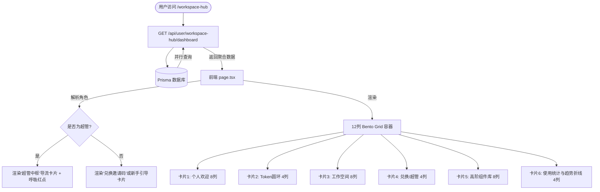

# 工作空间主控制台（workspace-hub）布局优化与平台解耦设计文档

> 日期：2026-06-14
> 状态：设计已确认

---

## 1. 设计目标与原则

### 各司其职，平台解耦
- **剥离超管审批逻辑**：彻底从 `workspace-hub` 中移除待审批升级申请的数据表格展示以及通过/驳回一键处理交互。这部分功能回归到全局管理员专区后台（`/admin/upgrade-applications`）。
- **轻量提醒与导流**：如果用户是超级管理员，在控制台中仅渲染一个极简高颜值的“超级管理员中枢”Bento 导流卡片，通过呼吸红点展示未处理申请数，并提供一键跳转专门后台的链接。
- **清除冗余按钮**：移除页面主体渲染的“注销/退出登录”物理按钮，相关功能由顶部的全局 `Header` 或个人设置页面统一托管。

### 完美 Bento Grid 网格系统
- 全面重构控制台布局为 12 列的流式 Bento 盒，使“舟坊研发高阶组件库”和“我的使用统计”作为核心网格完美融入。
- **布局划分（桌面端 md:grid-cols-12）**：
  - **第一行**：
    - [卡片 1] 个人欢迎与等级勋章块 (8 列)：欢迎词、头像、当前活跃空间名片。如果是管理员，此卡片内部或右侧附带运维提醒。
    - [卡片 2] SVG 算力 Token 配额圆环 (4 列)：包含炫彩渐变圆环和 VIP 升级营销导流。
  - **第二行**：
    - [卡片 3] 我的工作空间列表 (8 列)：个人空间与企业空间的联合列表展示，具备协同数、注销、扩容、分享弹窗操作。
    - [卡片 4] 兑换邀请码与快速设置中枢 (4 列)：为普通用户提供输入邀请码加入空间的极速交互；对超级管理员则动态呈现为“超级管理员中枢”运维监控气泡与后台跳转导流。
  - **第三行**：
    - [卡片 5] 舟坊研发高阶组件库 (8 列)：按阶段网格化流式展示高频热门组件，配以发光边框和 Hover 紫霓虹跃动动画，点击直接带参跳转工坊。
    - [卡片 6] 我的使用统计 (4 列)：显示累计调用、活跃组件、成功率、响应时间的指标气泡，并集成一条微型的 SVG 极速算力趋势波折线，充满硬核科技感。

---

## 2. 核心组件与数据流

### 数据流变动
1. **聚合 Dashboard 接口优化**：
   - 保留 `/api/user/workspace-hub/dashboard` 接口，但对于管理员，不再查询和返回完整的 `upgradeapplication` 申请明细列表，仅执行 `prisma.upgradeapplication.count({ where: { status: 'PENDING' } })` 获取未处理数量。这使得 API 响应体积缩减 90%，性能进一步提高。
2. **前端页面结构精简**：
   - 彻底移除 `handleAdminReview` 审批接口方法以及待审批表格的状态管理（如 `pendingApplications`）。
   - 移除 `handleDeleteAccount` 或就地注销逻辑。

---

## 3. UI 交互与极客质感提升

### 极客发光高阶组件库 (8 列)
- 卡片采用暗色半透明毛玻璃背景（`bg-white/80 backdrop-blur-xl border border-slate-200/60 shadow-sm`）。
- 选用高频使用的 4 个精品组件（如标书智能解析、合规审查、策略优化等），不再塞满 10 个阶段。
- 鼠标悬浮在组件小卡片上时，卡片边缘触发淡紫色的霓虹阴影扫描光效，图标微微上浮。

### 硬核科技使用统计 (4 列)
- 将累计调用数、成功率等 4 个指标封装在网格气泡内，用极简主义风格显示。
- **微型算力折线**：在卡片底部使用一个轻量级的 SVG 折线元素，通过模拟或近期的调用趋势数据生成路径 `<path d="..." />`，填充渐变微光，赋予页面以生命力与律动感。
